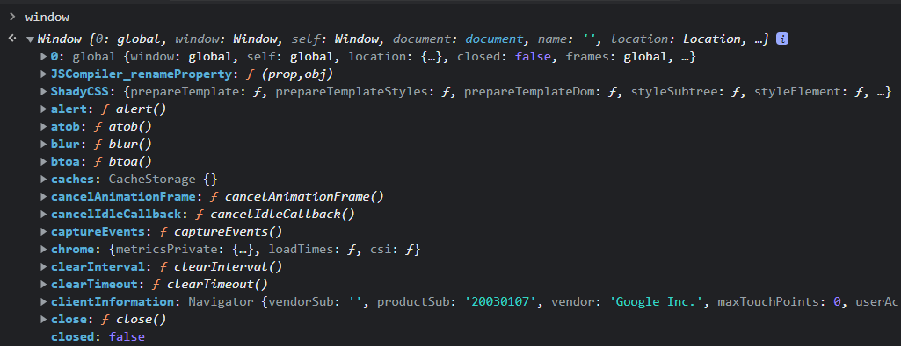
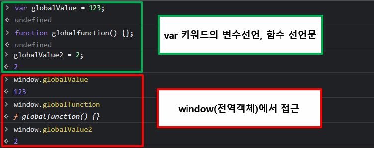

# JS 이론 정리
## 1. 변수
```javascript
console.log(score); //undefined
var score;
```
JS는 위에서 부터 한줄 식 실행하는 **인터프리터 언어**이기 때문에 _Reference Error_ 를 예측할 수 있다. 그러나 Console 창에서는 _undefined_ 결과를 출력한다.

두 줄의 코드가 javascript 내에서 어떻게 동작을 할까?

JS 엔진은 한줄씩 코드를 실행하기 전. 즉, 런타임 이전  **소스코드 평가 과정**이 존재한다.
> 모든 선언문(변수 선언문, 함수 선언문 등)을 소스코드에서 찾아 실행

즉, 
```javascript
console.log(score);
var score;              // 소스코드 평가에서 변수 선언문인 var score; 를 먼저 실행
```
var score; 줄을 실행할 때, 알아둬야하는 점이 있다. 변수선언에는 2가지 과정이 있다.
> 선언 단계 : 변수 이름을 등록해서 JS 엔진의 변수의 존재를 알린다.

> 초기화 단계 : 값을 저장하기 위해 메모리 공간을 확보하고, 암묵적으로 undefined를 할당한다.

여기서 **var** 키워드는 선언단계와 초기화 단계가 동시에 이루어진다.

정리하자면, 
1. 런타임 이전 **소스코드 평가과정**에 의해 변수 선언문인 var score; 가 먼저 실행이 된다.
2. **var** 키워드로 인해 변수 선언의 2가지 과정(선언단계, 초기화단계)이 동시에 이루어진다.
3. **소스코드 평가과정**이 끝나면 **런타임**에서 console.log(score); 로 인해 *score라는 변수이자 식별자가 가리키는 메모리 주소의 값인 undefined가 출력된다.*

이 과정에 의해 마치 밑에 변수가 맨 위에 선언된 것처럼 동작하는데, 이를 😁*호이스팅(hoisting)* 이라고 한다.

### 응용
```javascript
console.log(score);
var test = 1234;
```
그렇다면 위의 결과는 어떨까?
> 정답은 undefined 이다.
다시 한번 언급하자면 1. *JS 엔진은 **소스코드 평가과정**에 의해 선언문 부터 찾아낸다.* 2. *var* 키워드는 선언과 초기화를 동시에 진행한다.
그러나 값의 할당(1234)는 *소스코드 평가과정*에서 실행되지 않고, 런타임 과정에서 실행된다.
값이 할당되기 전 console.log(score); 가 실행되므로, **"undefined"** 이다. 

### 또 알아야 할것
```javascript
var score = 80;
score = 90;
```
위 코드는 다음과 같이 실행된다
> 1. 소스코드 평가과정에서 score에 undefined가 초기화 된다.
> 2. 런타임에서 score에 80이 할당된다.
> 3. score에 90이 할당된다.


위 코드가 실행되는 과정을 설명하였는데, 이것은 정확히 말하자면 틀렸다. 정확히는


> 1. 소스코드 평가과정에서 score에 undefined가 초기화 된다.
> 2. 런타임에서 80이 할당된 메모리 주소를 score 식별자가 가리킨다. 
> 3. 90이 할당된 메모리 주소를 score 식별자가 가리킨다.

🙄그렇다면 undefined와 80이 할당되어 있는 공간은? >>>>> 가비지 콜렉터에 메모리에서 자동해제 된다.

😁자세한 건 `5. 원시 타입과 객체(참조) 타입` 에서 확인.


## 2. 함수
### 함수 형태
#### 함수 선언문
```javascript
   function add(x, y) {
      return x+y;
   }
```

#### 함수 표현식
```javascript
   var add = function(x, y) {
      return x+y;
   }
```

#### Function 생상자 함수
```javascript
   var add = new Function('x', 'y', 'return x+y');
```

### 함수
```
console.log(add(2,3)); // 5
console.log(sub(4,3)); // TypeError : sub is not a function 

function add(x, y) {
   return x+y;
}

var sub = function (x,y) {
   return x-y;   
} 
```
변수에 이어 함수를 살펴보겠다. 위 코드는 어떻게 동작할까? 
변수 때 *소스코드 평가과정*에서 선언문(변수 선언, 함수 선언)을 먼저 찾아 실행한다고 했다.
*호이스팅* 현상으로 add함수는 호출이 되었지만, sub함수는 호출되지 않았다. 

이름 자체에서 add함수는 함수 선언문이고, sub 함수는 표현식이기 때문이다.
여기서 표현식을 간단히 구분하자면,
> 값을 생성, 참조하면 -> 표현식인 문

> 변수, 함수 선언은? -> 표현식이 아닌 문

var sub 자체는 *소스코드 평가과정*에서 실행이 되었겠지만, function (x,y) {} 는 표현식이기 때문에 런타임 때 sub에 할당이 될것이다.(JS에서 함수는 일급 객체이기 때문에 할당할 수 있는 것이다.) 즉, 함수 호이스팅이 아닌 변수 호이스팅이 발생한다.

> ※ 일급 객체? 값처럼 변수에 할당할수도 있고, 프로퍼티 값이 될수 있고, 배열 요소가 될수 있는 성질이 있다. 

변수선언과 미묘한 차이가 있다면 var 키워드로 인해 undefined가 출력되었으나, 함수 선언문은 암묵적으로 생성된 식별자 sub은 함수 객체로 초기화된다. 

어쨌든 함수선언문은 함수 호이스팅 현상 때문에 "함수를 호출하려면 호출 이전에 정의해야한다"를 무시하므로, 더글라스 크록포드는 함수 표현식을 권장한다. 

## 3. 전역 객체
전역객체(Global Object)는 JS엔진에 의해 가장 먼저 생성되는 특수한 객체이다.
브라우저에서는 `window`, NodeJS에서는 `Global `이 전역객체를 가리킨다.

</img><br/>
</img><br/>

## 4. 실행 컨텍스트
```javascript
var x;
x = 1;
```
앞서 변수에 대해 살펴봤다면 위 코드가 JS엔진에서 어떻게 동작하는지 알 수 있다.
이번 장에서는 "실행 컨텍스트"라는 것을 알아봐야 하는데, 위 코드 동작 과정을 "실행 컨텍스트"와 연관지은 설명이다.
1. 소스코드 평가 과정에서 변수 선언문인 **var x**를 실행한다.
2. 식별자 x는 실행 컨텍스트가 관리하는 스코프에 등록(선언)되고 undefined로 초기화 된다.
3. 런타임 과정에서 변수 할당문을 만나 **x=1;**만 실행된다. 이때 x 변수에 값을 할당하기 전 x가 존재하는지 확인한다.
4. 확인 과정은 실행 컨텍스트가 관리하는 스코프에 x 변수가 등록되어 있는지 확인한다.(=선언되어 있는지 확인한다.)

위에 ()넣어 설명했지만 다시 한번 설명하자면, 아래와 같다.
> 변수를 스코프에 등록 = 선언

이처럼 평가 > 실행 절차를 머리에 기억해두고, 이를 좀 확장해야한다. 그래야 실행컨텍스트에 좀더 가까워질수 있다.

```javascript
const x = 1;
const y = 2;

function foo(a) {
   const x = 10;
   const y = 20;
   
   console.log(a + x + y);
}

foo(100);
console.log(x + y);
```


실행 컨텍스트 소스코드 타입에 따라 실행 컨텍스트를 생성하는 과정과 관리 내용이 다르다.

전역코드 > 전역변수를 관리하기 위해 최상위 스코프인 전역 스코프를 생성한다. var와 함수 선언문으로 정의된 함수를
전역 객체의 프로퍼티와 메서드를 바인딩하고 참조하기 위해 전역 객체와 연결되어야한다.

함수 코드 > 함수 코드는 지역 스코프를 생성하고, 지역변수, 매개변수 arguments 객체를 관리한다. 생성한 지역 스코프를 전역스코프에서 시작하는 스코프 체인의 일원으로 연결해야한다. 이를 위해 함수 코드가 평가되면 함수 실행 컨텍스트가 생성된다.

## 5. 원시타입과 객체(참조)타입

원시 값은  `변경 불가능한 값` (주의 : "할당이 불가능하다." 라는 뜻은 아님)
객체(참조) 값  `변경이 가능한 값`


데이터 타입(숫자, 문자열, 불리언, null, undefined, symbol, 객체)

이걸 원시타입, 객체타입으로 구분

원시 값은 `변경 불가능한 값` (주의 : "할당이 불가능하다." 라는 뜻은 아님)
객체(참조) 값은  `변경이 가능한 값`

### 변수 할당 시 식별자와 메모리 주소
```javascript
var score = 80;
score = 90;
```
`1. 변수 : 또 알아야 할것` 에서 언급했던 것처럼 `score` 식별자는 `80`을 가지고 있는 메모리 주소를 가지고 있다가, `score=90`에서 `score` 식별자는 `90`을 가지고 있는 메모리 주소로 변경한다.

😀`score`의 메모리 주소 값이 바뀐것일 뿐, 메모리 공간 안에 있는 `80`이라는 값이 변경된 것은 아니다. 


### 값에 의한 전달
```javascript
let money = 5000;

let dMoney = money;

console.log(money, dMoney); // 5000 5000
console.log(money === dMoney); // true

money = 10000;
console.log(money, dMoney); // 5000 10000
console.log(money === dMoney); // false
```

`let dMoney = money;` 에서 `5000`이라는 원시 값을 새로운 메모리 주소 공간에 복사 후 `dMoney`가 이를 가리킨다. 즉, `같은 값이지만 서로 다른 공간을 가리키고 있는다.`

`money = 10000;` 에서는 당연히 새로운 메모리 공간에 `10000`을 할당하고 `money` 가 이 공간을 가리킨다. 

😀`값에 의한 전달`이  javascript를 위한 용어는 아니다. 기억해야 할 것은 `같은 값이지만 서로 다른 공간을 가리키고 있는다. 즉, 값을 변경하더라도 서로 간섭할 수 없다.`

### 참조에 의한 전달
```javascript 
var player = {
  name : 'Salah',
  goal : 19
}

var copyPlayer = player; //서로 다른 메모리 공간을 가리키지만, 참조하는 메모리 주소는 같다. 즉, 같은 곳을 참조하고 있다.
copyPlayer.name = "Mane";
player.goal = 13;

console.log(player); // [object Object] {goal: 13,name: "Mane"}
console.log(copyPlayer); // [object Object] {goal: 13,name: "Mane"}
```
원시 값은 `변경이 불가능한 값`이라서 변수의 값을 변경하라면 `재할당` 뿐이었지만, 객체 값은 `변경이 가능한 값`이다. 
`copyPlayer.name = "Mane"`, `player.goal = 13` 에서 객체 값을 변경하였다.
그리고 `두개의 식별자(player, copyPlayer)가 하나의 객체를 공유`하여 값이 같다.

😀`참조에 의한 전달`이  javascript를 위한 용어는 아니다. 기억해야 할 것은 `객체 타입은 변경이 가능한 값`이고, 참조 값이 전달되면 `같은 공간을 가리킨다.(참조 값이 같다.)`

## 6. this
### this의 기본
```javascript
//객체리터럴의 this
const player = {
	shootingPower : 90;
	shootingAccuracy : 40
	goalPercentage() {
		return (this.shootingPower + this.shootingAccuracy) / 2
	}
};
console.log(player.goalPercentage()); // 65

//생성자 함수 내부의 this
function Player() {
	this.shootingPower : 90;
	this.shootingAccuracy : 40
}

Player.prototype.goalPercentage = function() {
		return (this.shootingPower + this.shootingAccuracy) / 2
}
const player = new Player();
console.log(player.goalPercentage()); // 65
```
* (DeepDive p.343)
> `this`는 자신이 속한 객체 도는 자신이 생성할 인스턴스를 가리키는 자기 참조 변수다.
> `this`는 지역 변수처럼 사용할 수 있다.
> JS에서는 `this`가 가리키는 값, this 바인딩은 `함수 호출 방식`에 의해 동적으로 결정된다.

### 함수 호출 방식에 따른 this 바인딩
1. 일반함수호출 → this : window(전역객체) 바인딩
	> `strict mode`에서는 `undeifned`
	> 메서드 내 중첩함수든, 콜백함수든 일반함수로 호출되면 `this`는 `window` 바인딩
	
2. 메서드 호출 → this : `객체.메서드()`로 호출할 때 `객체를 바인딩`
	> this에 바인딩될 객체는 `호출 시점`에 결정된다.
	
3. 생성자 함수 호출 → this : 생성자 함수가 생성할 인스턴스 바인딩

4. function.prototpe.apply/call/bind → this : (apply/call/bind) 메서드의 첫번째 인수로 전달한 객체

### 화살표 함수에서의 this
```javascript
//콜백함수에서의 this 문제
class LastNamer {
  constructor(lastname) {
    this.lastname = lastname;
  }
  
  add(arr) {
    return arr.map(function(firstname) {
      return this.lastname + firstname;
    });
  }
}

const lastnamer = new LastNamer('Lee');
console.log(lastnamer.add(["Sangmin", "SangJun"]));

//arrow function으로 해결
class LastNamer {
  constructor(lastname) {
    this.lastname = lastname;
  }
  
  add(arr) {
    return arr.map(firstname => {
      return this.lastname + firstname;
    });
  }
}

const lastnamer = new LastNamer('Lee');
console.log(lastnamer.add(["Sangmin", "SangJun"]));
```
* (DeepDive p.480)
> 화살표 함수는 함수 자체의 this 바인딩을 갖지 않는다. `따라서 화살표 함수 내부의 this를 참조하면 상위 스코프의 this를 그대로 참조한다.` 이를 `Lexical this`라 한다.

### 핵심
```javascript
const normalCounter = {
  num : 1,
  increase() {
    return ++this.num
  }
};

console.log(normalCounter.increase()); //2

const arrowCounter = {
  num : 1,
  increase: () => ++this.num
};

console.log(arrowCounter.increase()); //Nan
```
😀결국 핵심은 `호출 시점`에 `normalCounter`의 일반함수 `increase()` 내`this`는 `객체를 binding` 하고, `arrowCounter`의 화살표 함수 `increase: () => {}`는 `함수 자체의 this 바인딩을 갖지 않고` 상위 스코프인 전역의 `this`가 가리키는 값(window)를 바인딩한다.(`Lexcial this`)

```javascript
var num = 100; 

const arrowCounter = {
  num : 1,
  increase: () => ++this.num
};

console.log(arrowCounter.increase()); //101
```