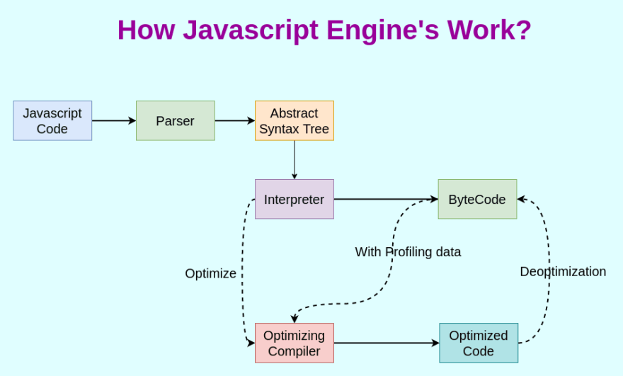

# JS 이론 정리

## 0. Javscript is interpreter??
프로그래밍 언어는 [고수준 언어(C, Python) → 저수준 언어(기계어)] 과정을 거친다.
* 컴파일러(Compiler)
   * 전체 파일을 번역하여 새로운 목적 파일을 생성.
   * 전체 파일을 번역하기 때문에 오래 걸리지만, 번역 이후에는 번역이 필요 없으므로 실행 속도가 빠름
* 인터프리터(interpreter)
   * 파일을 한줄 씩 읽고 번역하고 동시에 프로그램을 한줄 단위로 즉시 실행
   * 프로그램 실행 마다 번역해야 하므로 실행속도가 느림

Javascript는 interpreter 언어이다? → 실행되는 플랫폼에 따라 인터프리팅과 컴파일이 혼합되어 사용

* V8 엔진(그림 : https://dev.to/varunprashar5/how-javascript-engine-s-work-3cb0)


1. Javascript Code → (Token) → Parser → AST
   * 코드를 최소단위인 Token으로 분해 후 AST(추상적 구문트리)를 생성한다.
2. AST → Interpreter → ByteCode
   * AST는 Interpreter에 의해 ByteCode를 생성
3. Optimizing Compler → optimized code
   * 최적화 할 수 있는 코드를 컴파일러에게 전달, 원래 있던 코드에서 최적화된 코드로 변경
   * Ex) 반복해서 실행되는 코드 블록 등을 최적화하여 전달

→ `JIT(Just-In-Time) 컴파일` : 코드를 인터프리터 방식으로 실행하고, 필요할 때 컴파일하는 방법

→🙄 Javascript Code가 해석되고 실행되기까지 
                                                                

## 1. 변수
```javascript
console.log(score); //undefined
var score;
```
JS는 위에서 부터 한줄 식 실행하는 **인터프리터 언어**이기 때문에 _Reference Error_ 를 예측할 수 있다. 그러나 Console 창에서는 `undefined` 결과를 출력한다.

두 줄의 코드가 javascript 내에서 어떻게 동작을 할까?

JS 엔진은 한줄씩 코드를 실행하기 전. 즉, 런타임 이전  **소스코드 평가 과정**이 존재한다.
> 모든 선언문(변수 선언문, 함수 선언문 등)을 소스코드에서 찾아 실행

즉, 
```javascript
console.log(score);
var score;       // 소스코드 평가에서 변수 선언문인 var score; 를 먼저 실행
```
var score; 줄을 실행할 때, 알아둬야하는 점이 있다. 변수선언에는 2가지 과정이 있다.
> 선언 단계 : 변수 이름을 등록해서 JS 엔진의 변수의 존재를 알린다.

> 초기화 단계 : 값을 저장하기 위해 메모리 공간을 확보하고, 암묵적으로 undefined를 할당한다.

여기서 **var** 키워드는 선언단계와 초기화 단계가 동시에 이루어진다.

정리하자면, 
1. 런타임 이전 **소스코드 평가과정**에 의해 변수 선언문인 var score; 가 먼저 실행이 된다.
2. **var** 키워드로 인해 변수 선언의 2가지 과정(선언단계, 초기화단계)이 동시에 이루어진다.
3. **소스코드 평가과정**이 끝나면 **런타임**에서 console.log(score); 로 인해 *score라는 변수이자 식별자가 가리키는 메모리 주소의 값인 undefined가 출력된다.*

이 과정에 의해 마치 밑에 변수가 맨 위에 선언된 것처럼 동작하는데, 이를 😁*호이스팅(hoisting)* 이라고 한다.

### 응용
```javascript
console.log(score);
var test = 1234;
```
그렇다면 위의 결과는 어떨까?
> 정답은 undefined 이다.
다시 한번 언급하자면 1. *JS 엔진은 **소스코드 평가과정**에 의해 선언문 부터 찾아낸다.* 2. *var* 키워드는 선언과 초기화를 동시에 진행한다.
그러나 값의 할당(1234)는 *소스코드 평가과정*에서 실행되지 않고, 런타임 과정에서 실행된다.
값이 할당되기 전 console.log(score); 가 실행되므로, **"undefined"** 이다. 

### 또 알아야 할것
```javascript
var score = 80;
score = 90;
```
위 코드는 다음과 같이 실행된다
> 1. 소스코드 평가과정에서 score에 undefined가 초기화 된다.
> 2. 런타임에서 score에 80이 할당된다.
> 3. score에 90이 할당된다.


위 코드가 실행되는 과정을 설명하였는데, 이것은 정확히 말하자면 틀렸다. 정확히는


> 1. 소스코드 평가과정에서 score에 undefined가 초기화 된다.
> 2. 런타임에서 80이 할당된 메모리 주소를 score 식별자가 가리킨다. 
> 3. 90이 할당된 메모리 주소를 score 식별자가 가리킨다.

🙄그렇다면 undefined와 80이 할당되어 있는 공간은? >>>>> 가비지 콜렉터에 메모리에서 자동해제 된다.

😁자세한 건 `5. 원시 타입과 객체(참조) 타입` 에서 확인.


## 2. 함수
### 함수 형태
#### 함수 선언문
```javascript
   function add(x, y) {
      return x+y;
   }
```

#### 함수 표현식
```javascript
   var add = function(x, y) {
      return x+y;
   }
```

#### Function 생상자 함수
```javascript
   var add = new Function('x', 'y', 'return x+y');
```

### 함수
```
console.log(add(2,3)); // 5
console.log(sub(4,3)); // TypeError : sub is not a function 

function add(x, y) {
   return x+y;
}

var sub = function (x,y) {
   return x-y;   
} 
```
변수에 이어 함수를 살펴보겠다. 위 코드는 어떻게 동작할까? 
변수 때 *소스코드 평가과정*에서 선언문(변수 선언, 함수 선언)을 먼저 찾아 실행한다고 했다.
*호이스팅* 현상으로 add함수는 호출이 되었지만, sub함수는 호출되지 않았다. 

이름 자체에서 add함수는 함수 선언문이고, sub 함수는 표현식이기 때문이다.
여기서 표현식을 간단히 구분하자면,
> 값을 생성, 참조하면 -> 표현식인 문

> 변수, 함수 선언은? -> 표현식이 아닌 문

var sub 자체는 *소스코드 평가과정*에서 실행이 되었겠지만, function (x,y) {} 는 표현식이기 때문에 런타임 때 sub에 할당이 될것이다.(JS에서 함수는 일급 객체이기 때문에 할당할 수 있는 것이다.) 즉, 함수 호이스팅이 아닌 변수 호이스팅이 발생한다.

> ※ 일급 객체? 값처럼 변수에 할당할수도 있고, 프로퍼티 값이 될수 있고, 배열 요소가 될수 있는 성질이 있다. 

변수선언과 미묘한 차이가 있다면 var 키워드로 인해 undefined가 출력되었으나, 함수 선언문은 암묵적으로 생성된 식별자 sub은 함수 객체로 초기화된다. 

어쨌든 함수선언문은 함수 호이스팅 현상 때문에 "함수를 호출하려면 호출 이전에 정의해야한다"를 무시하므로, 더글라스 크록포드는 함수 표현식을 권장한다. 

## 3. 전역 객체
전역객체(Global Object)는 JS엔진에 의해 가장 먼저 생성되는 특수한 객체이다.
브라우저에서는 `window`, NodeJS에서는 `Global `이 전역객체를 가리킨다.

</img><br/>
</img><br/>

## 4. 실행 컨텍스트
```javascript
var x;
x = 1;
```
앞서 변수에 대해 살펴봤다면 위 코드가 JS엔진에서 어떻게 동작하는지 알 수 있다.
이번 장에서는 "실행 컨텍스트"라는 것을 알아봐야 하는데, 위 코드 동작 과정을 "실행 컨텍스트"와 연관지은 설명이다.
1. 소스코드 평가 과정에서 변수 선언문인 **var x**를 실행한다.
2. 식별자 x는 실행 컨텍스트가 관리하는 스코프에 등록(선언)되고 undefined로 초기화 된다.
3. 런타임 과정에서 변수 할당문을 만나 **x=1;**만 실행된다. 이때 x 변수에 값을 할당하기 전 x가 존재하는지 확인한다.
4. 확인 과정은 실행 컨텍스트가 관리하는 스코프에 x 변수가 등록되어 있는지 확인한다.(=선언되어 있는지 확인한다.)

위에 ()넣어 설명했지만 다시 한번 설명하자면, 아래와 같다.
> 변수를 스코프에 등록 = 선언

이처럼 평가 > 실행 절차를 머리에 기억해두고, 이를 좀 확장해야한다. 그래야 실행컨텍스트에 좀더 가까워질수 있다.

```javascript
const x = 1;
const y = 2;

function foo(a) {
   const x = 10;
   const y = 20;
   
   console.log(a + x + y);
}

foo(100);
console.log(x + y);
```


실행 컨텍스트 소스코드 타입에 따라 실행 컨텍스트를 생성하는 과정과 관리 내용이 다르다.

전역코드 > 전역변수를 관리하기 위해 최상위 스코프인 전역 스코프를 생성한다. var와 함수 선언문으로 정의된 함수를
전역 객체의 프로퍼티와 메서드를 바인딩하고 참조하기 위해 전역 객체와 연결되어야한다.

함수 코드 > 함수 코드는 지역 스코프를 생성하고, 지역변수, 매개변수 arguments 객체를 관리한다. 생성한 지역 스코프를 전역스코프에서 시작하는 스코프 체인의 일원으로 연결해야한다. 이를 위해 함수 코드가 평가되면 함수 실행 컨텍스트가 생성된다.

## 5. 원시타입과 객체(참조)타입

데이터 타입(숫자, 문자열, 불리언, null, undefined, symbol, 객체)

이걸 원시타입, 객체타입으로 구분

원시 값은 `변경 불가능한 값` (주의 : "할당이 불가능하다." 라는 뜻은 아님)

객체(참조) 값은  `변경이 가능한 값`

### 변수 할당 시 식별자와 메모리 주소
```javascript
var score = 80;
score = 90;
```
`1. 변수 : 또 알아야 할것` 에서 언급했던 것처럼 `score` 식별자는 `80`을 가지고 있는 메모리 주소를 가지고 있다가, `score=90`에서 `score` 식별자는 `90`을 가지고 있는 메모리 주소로 변경한다.

😀`score`의 메모리 주소 값이 바뀐것일 뿐, 메모리 공간 안에 있는 `80`이라는 값이 변경된 것은 아니다. 


### 값에 의한 전달
```javascript
let money = 5000;

let dMoney = money;

console.log(money, dMoney); // 5000 5000
console.log(money === dMoney); // true

money = 10000;
console.log(money, dMoney); // 5000 10000
console.log(money === dMoney); // false
```

`let dMoney = money;` 에서 `5000`이라는 원시 값을 새로운 메모리 주소 공간에 복사 후 `dMoney`가 이를 가리킨다. 즉, `같은 값이지만 서로 다른 공간을 가리키고 있는다.`

`money = 10000;` 에서는 당연히 새로운 메모리 공간에 `10000`을 할당하고 `money` 가 이 공간을 가리킨다. 

😀`값에 의한 전달`이  javascript를 위한 용어는 아니다. 기억해야 할 것은 `같은 값이지만 서로 다른 공간을 가리키고 있는다. 즉, 값을 변경하더라도 서로 간섭할 수 없다.`

### 참조에 의한 전달
```javascript 
var player = {
  name : 'Salah',
  goal : 19
}

var copyPlayer = player; //서로 다른 메모리 공간을 가리키지만, 참조하는 메모리 주소는 같다. 즉, 같은 곳을 참조하고 있다.
copyPlayer.name = "Mane";
player.goal = 13;

console.log(player); // [object Object] {goal: 13,name: "Mane"}
console.log(copyPlayer); // [object Object] {goal: 13,name: "Mane"}
```
원시 값은 `변경이 불가능한 값`이라서 변수의 값을 변경하라면 `재할당` 뿐이었지만, 객체 값은 `변경이 가능한 값`이다. 
`copyPlayer.name = "Mane"`, `player.goal = 13` 에서 객체 값을 변경하였다.
그리고 `두개의 식별자(player, copyPlayer)가 하나의 객체를 공유`하여 값이 같다.

😀`참조에 의한 전달`이  javascript를 위한 용어는 아니다. 기억해야 할 것은 `객체 타입은 변경이 가능한 값`이고, 참조 값이 전달되면 `같은 공간을 가리킨다.(참조 값이 같다.)`

## 6. this
### this의 기본
```javascript
//객체리터럴의 this
const player = {
	shootingPower : 90;
	shootingAccuracy : 40
	goalPercentage() {
		return (this.shootingPower + this.shootingAccuracy) / 2
	}
};
console.log(player.goalPercentage()); // 65

//생성자 함수 내부의 this
function Player() {
	this.shootingPower : 90;
	this.shootingAccuracy : 40
}

Player.prototype.goalPercentage = function() {
		return (this.shootingPower + this.shootingAccuracy) / 2
}
const player = new Player();
console.log(player.goalPercentage()); // 65
```
* (DeepDive p.343)
> `this`는 자신이 속한 객체 도는 자신이 생성할 인스턴스를 가리키는 자기 참조 변수다.
> `this`는 지역 변수처럼 사용할 수 있다.
> JS에서는 `this`가 가리키는 값, this 바인딩은 `함수 호출 방식`에 의해 동적으로 결정된다.

### 함수 호출 방식에 따른 this 바인딩
1. 일반함수호출 → this : window(전역객체) 바인딩
	> `strict mode`에서는 `undeifned`
	> 메서드 내 중첩함수든, 콜백함수든 일반함수로 호출되면 `this`는 `window` 바인딩
	
2. 메서드 호출 → this : `객체.메서드()`로 호출할 때 `객체를 바인딩`
	> this에 바인딩될 객체는 `호출 시점`에 결정된다.
	
3. 생성자 함수 호출 → this : 생성자 함수가 생성할 인스턴스 바인딩

4. function.prototpe.apply/call/bind → this : (apply/call/bind) 메서드의 첫번째 인수로 전달한 객체

### 화살표 함수에서의 this
```javascript
//콜백함수에서의 this 문제
class LastNamer {
  constructor(lastname) {
    this.lastname = lastname;
  }
  
  add(arr) {
    return arr.map(function(firstname) {
      return this.lastname + firstname;
    });
  }
}

const lastnamer = new LastNamer('Lee');
console.log(lastnamer.add(["Sangmin", "SangJun"]));

//arrow function으로 해결
class LastNamer {
  constructor(lastname) {
    this.lastname = lastname;
  }
  
  add(arr) {
    return arr.map(firstname => {
      return this.lastname + firstname;
    });
  }
}

const lastnamer = new LastNamer('Lee');
console.log(lastnamer.add(["Sangmin", "SangJun"]));
```
* (DeepDive p.480)
> 화살표 함수는 함수 자체의 this 바인딩을 갖지 않는다. `따라서 화살표 함수 내부의 this를 참조하면 상위 스코프의 this를 그대로 참조한다.` 이를 `Lexical this`라 한다.

### 핵심
```javascript
const normalCounter = {
  num : 1,
  increase() {
    return ++this.num
  }
};

console.log(normalCounter.increase()); //2

const arrowCounter = {
  num : 1,
  increase: () => ++this.num
};

console.log(arrowCounter.increase()); //Nan
```
😀결국 핵심은 `호출 시점`에 `normalCounter`의 일반함수 `increase()` 내`this`는 `객체를 binding` 하고, `arrowCounter`의 화살표 함수 `increase: () => {}`는 `함수 자체의 this 바인딩을 갖지 않고` 상위 스코프인 전역의 `this`가 가리키는 값(window)를 바인딩한다.(`Lexcial this`)

```javascript
var num = 100; 

const arrowCounter = {
  num : 1,
  increase: () => ++this.num
};

console.log(arrowCounter.increase()); //101
```
## 7. Class
### __*Class 알기 전.. 프로토타입(prototype)에 대해*__
```javascript
//Prototype 사용 X
function Player(name) {
  this.name = name;
  this.shooting = function () {
    console.log(`${this.name} shoot!!!!`);
  }
}

const player1 = new Player("Salah");
const player2 = new Player("Mane");

console.log(player1.shooting === player2.shooting); //false
//this.shooting은 생성된 각자의 인스턴스 객체에 속하기 때문에, 내용은 같지만 다르다.
```

```javascript
//prototype 사용
function Player(name) {
  this.name = name;
}

//Javascript는 Prototype 기반으로 상속을 구현한다.
Player.prototype.shooting = function() {
  console.log(`${this.name} shoot!!!!`);
}

const player1 = new Player("Salah");
const player2 = new Player("Mane");
player1.shooting(); //Salah shoot!!!!
player2.shooting(); //Mane shoot!!!!

console.log(console.log(player1.shooting === player2.shooting); //true
//각자 다른 인스턴스 객체이지만, Prototype 함수를 통해 공유(상속)되어 같은 것을 확인할 수 있다.

console.log(player1.shooting)
// ƒ () {
//   console.log(`${this.name} shoot!!!!`);
// }
```
😀 Javascript가 이루고 있는 거의 모든 것이 `객체`라는 점에서(함수, 배열, 정규 표현식 등 제외) `prototype` 기반의 상속은 중복되는 코드를 줄여줄 수 있다.

😀 ES6부터 도입한 `Class`도 결국 객체를 표현하기 위한 하나의 매커니즘이다.

```javascript
//뒤에 클래스에서 보면 알겠지만, 클래스 내 메서드는 "프로토타입 메서드"이므로, 클래스를 통해 생성된 객체들은 protoype 함수를 통해 공유(상속)되어 같은것을 확인할 수 있다.
class Player {
    constructor(name) {
        this.name = name;
    }
    shooting() {
        console.log(name);
    }
}
const player1 = new Player("Salah");
const player2 = new Player("Mane");
console.log(player1.shooting === player2.shooting) //true!
```

#### 프로토타입 객체
* 프로토타입은 객체 간 상속을 구현하기 위해 사용된다.
* 모든 객체는 `__proto__` 접근자 프로퍼티를 통해 자신의 프로토타입, 즉 `[[Prototype]]` 내부 슬룻에 접근할 수 있다.
```javascript
//크롬 개발자 도구에서..

player1
//Player {name: 'Salah'}
//- name: "Salah"
//- [[Prototype]]: Object
//  - constructor: class Player
//  - shooting: ƒ shooting()
//  - [[Prototype]]: Object

player1.__proto__
//{constructor: ƒ, shooting: ƒ}
//  - constructor: class Player
//  - shooting: ƒ shooting()
//  - [[Prototype]]: Object
```
* 하지만, `__proto__` 접근자 프로퍼티를 직접 사용하는 것은 권장하지 않음!

#### 프로토타입 체인
> JS는 객체 프러퍼티에 접근하려고 할때 해당 객체에 접근하려는 프로퍼티가 없다면 [[Prototype]] 내부 슬룻의 참조를 따라 자신의 부모 역할을 하는 프로토타입의 프로퍼티를 순차적으로 검색하는데 이를 `프로토타입 체인`이라고 한다.

> JS엔진은 `프로토타입 체인`에 따라 `프로퍼티/메서드`를 검색한다. 즉, 객체 간의 상속 관계로 이루어진 프로토타입의 계층적인 구조에서 객체 프로퍼티를 검색한다.

> 프로퍼티가 아닌 나머지 식별자는 `스코프 체인`에서 검색한다.
### Class의 기본
* Class를 알기 전, JS의 Class는 완전한 Class가 아니다.
* JS에서 `Class는 함수`이며, 새로운 객체 생성의 매커니즘이다.
* Class 내부에서 `strict mode`로 실행된다.
```javascript
//클래스 선언문
class Player {}
console.log(typeof Player); //function
```
* 클래스 선언문으로 정의한 클래스는 `소스코드 평가 과정`에서 함수 객체를 생성한다.
* 생성된 함수 객체는 생성자 함수로서 호출할 수 있는 `constructor`이며,
* 함수 객체를 생성한 시점에 `프로토타입`도 생성한다. (프로토타입과 생성자함수는 언제나 쌍이다)

```javascript
//변수 호이스팅
console.log(player); // "ReferenceError: Cannot access 'player' before initialization

const player = "Salah"; 


//클래스 호이스팅
console.log(Person); // "ReferenceError: Cannot access 'Person' before initialization

class Person {}; 
```
* `클래스 호이스팅`은 `let`, `const`처럼 `일시적 사각지대(TDZ)`가 발생된다.

### 메서드
* constructor : 인스턴스를 생성하고 초기화하기 위한 특수한 메서드
```javascript
class Player {
    constructor(name) {
        this.name = name;
    }
}

const player1 = new Player("Salah");
console.log(player1.constructor === Player) //true
console.log(layer1.__proto__ === Player.prototype)// true

console.log(typeof Player); // function

console.dir(Player);
// class Player
// length: 1
// name: "Player"
// prototype:
//    constructor: class Player // 자기 자신(Class)
//    [[Prototype]]: Object
// arguments: (...)
// caller: (...)
// [[FunctionLocation]]: VM451:2
// [[Prototype]]: ƒ ()
// [[Scopes]]: Scopes[2]
```
* prototype 메서드 : 클래스 몸체에서 정의한 함수 (기본적으로 프로토타입 메서드가 된다.)
```javascript
class Player {
  constructor(name) {
      this.name = name;
  }

  //prototype method
  getName() {
    console.log(`His name is ${this.name}.`);
  }
}

const playerSalah = new Player("Salah");
playerSalah.getName(); //His name is Salah.
```
* 정적 메서드 : 인스턴스를 생성하지 않아도 호출 가능한 메서드
```javascript
class Player {
  constructor(name) {
      this.name = name;
  }

  //static method
  static getName() {
    console.log(`His name is ${this.name}.`);
  }
}

//클래스만이 static 메서드를 호출할 수 있다.
Player.getName(); //His name is Player.

//인스턴스는 불가능
const playerSalah = new Player("Salah");
playerSalah.getName(); //Uncaught TypeError: playerSalah.getName is not a function

//constructor는 클래스를 가리키기 때문에 밑 방식처럼 접근해야한다.
playerSalah.constructor.getName(); //His name is Player.
```

😀 `프로토타입 메서드`은 `클래스`에 속해있다.(클래스에서 호출하고, 인스턴스 프로퍼티 참조가 가능) 😀`정적 메서드`는 `인스턴스` 속해있다.(인스턴스에서 호출하고, 인스턴스 프로퍼티 참조가 불가능)

### 접근 제어자
* private 필드 정의는 직접적으로 접근이 불가하며, getter or setter으로 접근해야한다.
```javascript
class Player {
  #name = ''; //이게 private

  constructor(name) {
    this.#name = name;
  }

  get Name() {
    return this.#name;
  }
}

const player = new Player("Salah");

//Uncaught SyntaxError: Private field '#name' must be declared in an enclosing class
console.log(player.#name); 

console.log(player.Name); //Salah
```

### 상속
```javascript
// 수퍼클래스
class Person {
  constructor(weight, height) {
    this.weight = weight;
    this.height = height;
  }
}

//서브클래스
class Player extends Person {
  constructor(weight, height, position) {
    super(weight, height);
    this.position = position;
  }
  //만약 constructor를 생략하면 암묵적으로 constructor(...args) { super(...args)}
}

const player = new Player(180, 73, "Defender");
```


### 8. Promise 객체

#### 생겨난 이유? 
 - 비동기 처리 결과에 대한 후속 처리는 `콜백함수`뿐이다. 왜냐하면 비동기 처리 결과는 외부에 반환할 수 없고, 상위 스코프 변수에도 할당할 수 없기 때문이다.(선행 : "실행 컨텍스트(콜스택), 태스크 큐, 이벤트 루프"를 파악하면 알 수 있다.)
 - 하지만 그에 대한 처리 과정이 많다면? 그만큼의 콜백 함수 호출이 필요하다. 많은 콜백 함수 호출이 중첩되어 복잡도가 높아지는 현상이 `콜백 헬`이다.

Promise 생성자 함수는 비동기 처리를 수행할 콜백 한수를 인수로 전달 받는다. 이 콜백 함수는 resolve와 reject 함수를 인수로 전달 받는다.
```javascript
const promise = new Promise((resolve, reject) => {
	if() {
		resolve('result');
	} else {
		reject('failure');
	}
});
```
#### Promise 상태 정보
* pending : 비동기 처리가 아직 수행되지 않은 상태(프로미스가 생성된 직후)
* settled(fulfilled, rejected) : 비동기가 처리된 상태(fulfilled : 성공, rejected: 실패)

#### Promise 후속 메서드 인수정리
* then : fulfilled 상태에는 resolve, rejected 상태에는 reject
* catch : Promise가 rejected인 경우만
 * catch를 then 뒤에다가 쓰는 이유 :  catch메서드는 then 메서드를 호출한 이후에 호출하면 비동기 처리에 대 한 에러 + then 메서드 내부에서 발생한 에러까지 모두 캐치가 가능하다.
* finally : fulfilled나 rejected 경우 상관 없이 무조건 실행

😀 `fetch`는 HTTP 응답을 나타내는 Response를 래핑한 `Promise` 객체를 반환한다..


