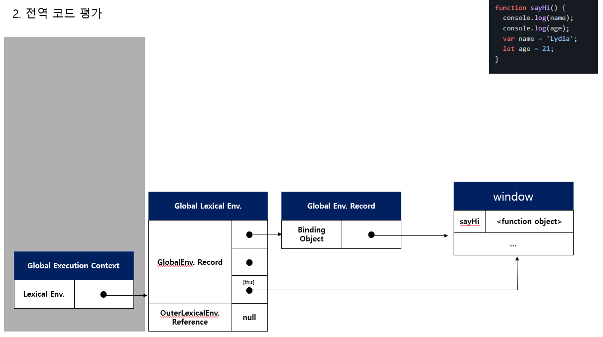
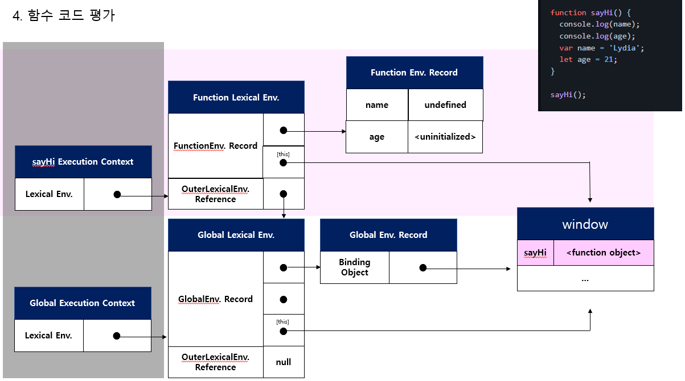
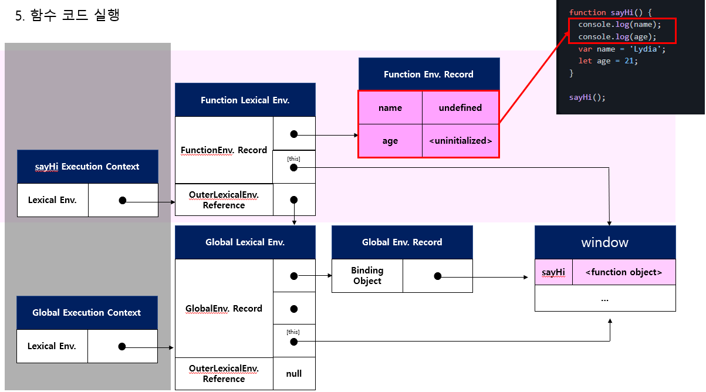
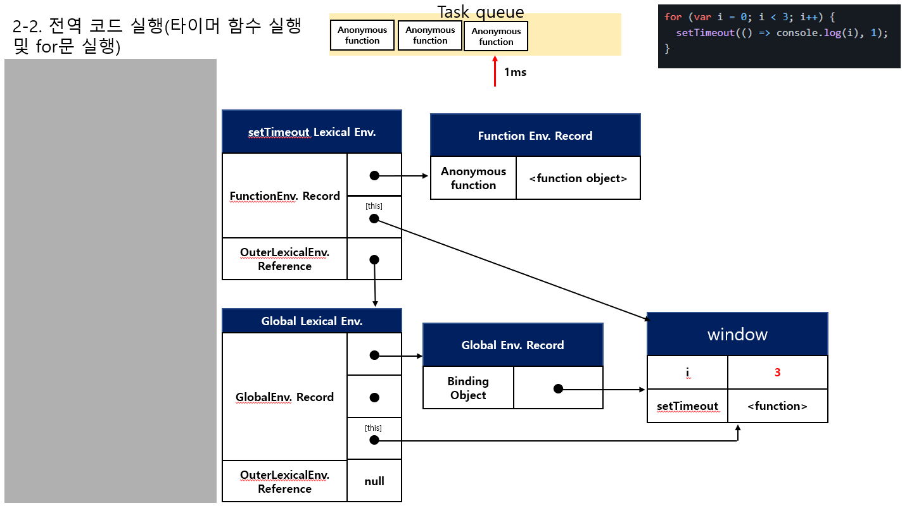
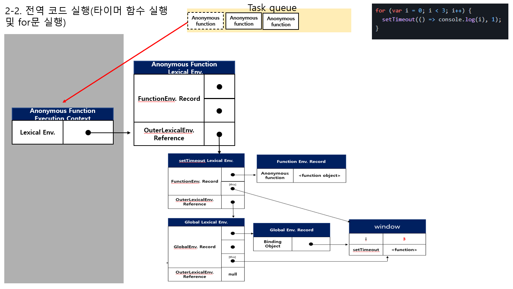
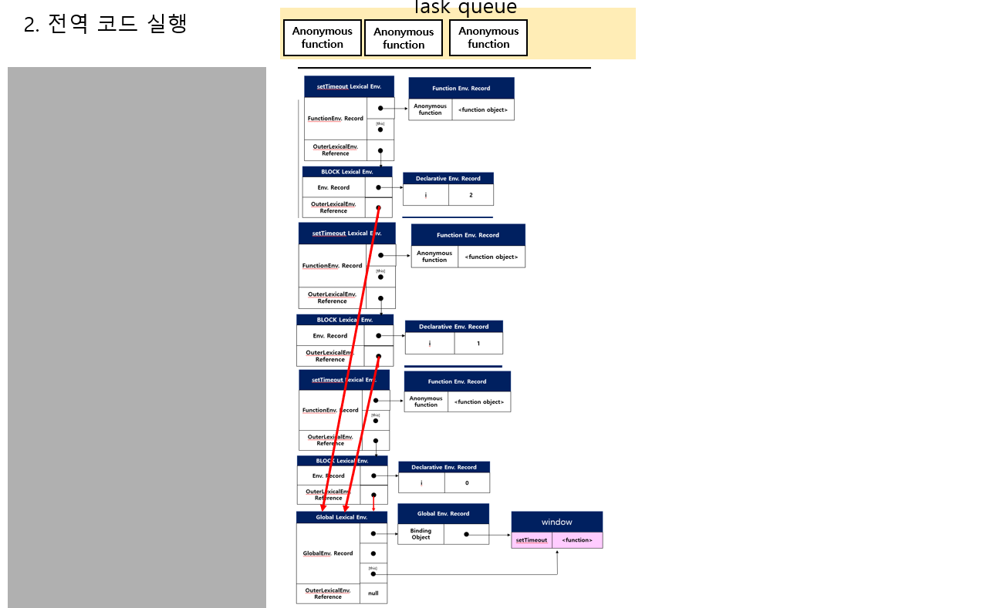
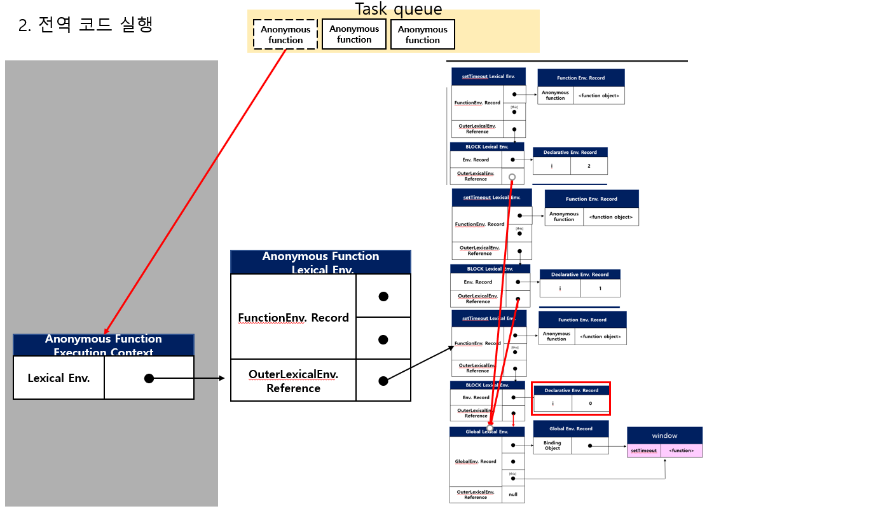

# JS 문제 풀기

> 참고 사이트 : <https://github.com/lydiahallie/javascript-questions>

Thank you! lydiahallie😍

## 1번문제

```javascript
function sayHi() {
  console.log(name);
  console.log(age);
  var name = 'Lydia';
  let age = 21;
}

sayHi();
```

- A: `Lydia` and `undefined`
- B: `Lydia` and `ReferenceError`
- C: `ReferenceError` and `21`
- D: `undefined` and `ReferenceError`

<details>
<summary>My Answer</summary>
<p>정답은 <code>D</code></p>
<ol>
  <li>함수 선언과 호출</li>
  <li>var와 let의 차이</li>
  <li>변수 호이스팅</li>
  <li>코드 평가와 실행</li>
</ol>
  <p>1. 전역에서 sayHi함수가 선언문으로 정의했다. "전역 코드 평가" 시 전역 객체 프로퍼티가 된다. 평가 후 "전역 코드 실행" 때 함수 호출을 실행한다.</p>
  <p>2. 함수 호출 실행 시 "전역 코드 실행"을 멈추고 "함수 코드 평가" 에 들어간다. <code>var name</code>와 <code>let age</code>이 <code>function Env.Record</code>에 등록이 되는데 <code>var</code>는 "선언단계"와 "초기화 단계"가 동시에 이루어져 "undefined"가 할당이 된다. let은 선언단계만 진행이 되므로 "uninitialized"이고, 초기화 단계는 "함수 코드 실행" 시 할당문('=')을 만났을 때 초기화가 이루어진다. </p>
  <p>3."함수 코드 실행" 단계에서 "console" 이라는 함수를 찾기 위해 <code>스코프 체이닝</code> 과정으로 "window" 전역 객체의 프로퍼티에 접근하여 console.log를 실행한다. 참조하는 변수의 name은 위에서처럼 "undefined", age는 "Reference Error" 가 발생한다. 선언 전에 밑에 있는 변수를 위에 끌어다 쓰는 것처럼 보여 이를 <code>변수 호이스팅</code>이라 한다.</p>
  <p> → let으로 선언한 변수의 경우 초기화 전 참조를 하여 이를 <code>TDZ(일시적 사각지대)</code>라고 한다.</p>
  <details>
    <summary>그림</summary>
    </img><br/>
    </img><br/>
    </img><br/>
    </img><br/>
    </img><br/>
  </details>
</details>

## 2번문제

```javascript
for (var i = 0; i < 3; i++) {
  setTimeout(() => console.log(i), 1);
}

for (let i = 0; i < 3; i++) {
  setTimeout(() => console.log(i), 1);
}
```

- A: `0 1 2` and `0 1 2`
- B: `0 1 2` and `3 3 3`
- C: `3 3 3` and `0 1 2`
  <details>
    <summary>My Answer</summary>
    <p>정답은 <code>C</code></p>
    <ol>
      <li>블록레벨 스코프(for)</li>
      <li>var와 let,const의 차이</li>
      <li>렉시컬 환경, 스코프</li>
      <li>콜백함수</li>
      <li>클로저</li>
      <li>이벤트 루프 그리고 콜 스택과 테스트 큐</li>
    </ol>
    <p><code>(Javascript DeepDive p.387 참조)</code><strong>for문의 변수 선언문에 let 키워드를 사용한 for문은 코드블록이 반복해서 실행될때마다 코드블록을 위한 새로운 렉시컬 환경을 생성</strong>한다. 만약 for문의 코드 블록 내에서 정의된 함수가 있다면 이 함수의 상위스코프는 for문의 코드 블록이 생성한 렉시컬 환경이다.</p>
    <p>외부 렉시컬 환경 참조는 <strong>자신이 정의된 환경(상위 스코프)</strong>을 가리킨다.</p>
    <p>[[Enviroment]]도 <strong>자신이 정의된 환경(상위스코프)</strong>을 가리킨다.</p>
    <p><code>(Javascript DeepDive p.386 참조)</code><code>var</code>키워드로 선언한 변수는 오로지 함수의 코드 블록만 지역 스코프로 인정(이걸 함수레벨 블록이라 한다), <code>let</code>, <code>const</code>는 모든 코드 블록을 지역스코프로 인정한다.(블록레벨스코프)</p>
    <p>setTimeout 함수의 렉시컬 환경은 <code>익명함수(anonymous function)</code>의 [[Enviroment]] 내부 슬롯에 의해 참조되고 있어 가비지 컬렉터가 해제하지 않는다. 외부함수(setTimeout)보다 중첩함수(anonymous function)이 더 오래 유지 되었으며, 외부 함수의 변수를 참조할 수 있다. 이러한 중첩 함수를 클로저(closure)라 한다.</p>
    <p>콜백함수는 매개변수로 넘겨지는 함수를 콜백함수라고하고, 매겨변수를 받는 함수를 고차함수라 한다.</p>
    <p>setTimeout, setInterval 같은 함수들은 호출한 후 delay(ms) 후에 Task Queue에 들어가 대기한다. 그리고 실행컨텍스트 스택(콜 스택)이 비워졌을 때 선입선출방식으로 함수가 실행된다.</p>

    <details>
      <summary>그림</summary>
      </img><br/>
      </img><br/>
      </img><br/>
      </img><br/>
    </details>
  </details>

## 3번문제

```javascript
const shape = {
  radius: 10,
  diameter() {
    return this.radius * 2;
  },
  perimeter: () => 2 * Math.PI * this.radius,
};

console.log(shape.diameter());
console.log(shape.perimeter());
```

- A: `20` and `62.83185307179586`
- B: `20` and `NaN`
- C: `20` and `63`
- D: `NaN` and `63`
<details>
<summary>My Answer</summary>
<p>정답은 <code>B</code></p>
<p></p>
<ol>
  <li>일반함수와 화살표함수의 this</li>
</ol>
<p>객체<code>메서드</code>의 <code>this</code>는 객체를 바인딩하고, 객체 프로퍼티에 할당된 <code>arrow function</code>의 <code>this</code>는 해당 코드에서의 상위 컨텍스트인 전역객체를 가리킨다.</p>
<code>
*자세한 내용은 6. this : 핵심 부분에서
</code>
</details>

## 6번문제

```javascript
let c = { greeting: 'Hey!' };
let d;

d = c;
c.greeting = 'Hello';
console.log(d.greeting);
```

- A: `Hello`
- B: `Hey!`
- C: `undefined`
- D: `ReferenceError`
- E: `TypeError`

<details>
<summary>My Answer</summary>
<p>정답은 <code>A</code></p>
<ol>
  <li>참조에 의한 전달</li>
</ol>
<p>c의 참조 값(객체의 메모리 주소 값)을 복사하여 전달하기 때문에, 두개의 식별자(c, d)가 하나의 객체를 공유하여 값이 같다.</p>
<code>
*자세한 내용은 5. 원시타입과 객체(참조)타입에서
</code> 
</details>

## 8번문제

```javascript
class Chameleon {
  static colorChange(newColor) {
    this.newColor = newColor;
    return this.newColor;
  }

  constructor({ newColor = 'green' } = {}) {
    this.newColor = newColor;
  }
}

const freddie = new Chameleon({ newColor: 'purple' });
console.log(freddie.colorChange('orange'));
```

- A: `orange`
- B: `purple`
- C: `green`
- D: `TypeError`

<details>
<summary>My Answer</summary>
<p>정답은 <code>D</code></p>
<ol>
  <li>생성자, 인스턴스</li>
  <li>static(정적) 메서드</li>
</ol>
<p>static(정적) 메서드는 인스턴스를 생성하지 않아도 호출할 수 있는 메서드이다.</p>
<p>정적 메서드는 클래스로 호출한다.(인스턴스로는 호출할 수 없다.)</p>
<code>
*자세한 내용은 7. 클래스에서
</code> 
</details>

## 10번문제

```javascript
function bark() {
  console.log('Woof!');
}

bark.animal = 'dog';
```

- A: Nothing, this is totally fine!
- B: SyntaxError. You cannot add properties to a function this way.
- C: "Woof" gets logged.
- D: ReferenceError

<details>
<summary>My Answer</summary>
<p>정답은 <code>A</code></p>
<ol>
  <li></li>
</ol>
<p>원시 값(숫자, 문자열)을 제외한 Javascript의 거의 모든 것은 객체다. 코드평가 중 정의된 함수가 등록이 되면 함수객체가 만들어진다는 점에서 알 수 있다. 실제로 위 코드처럼 작성하지는 않겠지만, <code>함수객체.animal = 'dog'</code>이 실행되면 함수객체.animal에 dog가 할당된다.</p>
</details>

## 11번문제

```javascript
function Person(firstName, lastName) {
  this.firstName = firstName;
  this.lastName = lastName;
}

const member = new Person('Lydia', 'Hallie');
Person.getFullName = function () {
  return `${this.firstName} ${this.lastName}`;
};

console.log(member.getFullName());
```

- A: `TypeError`
- B: `SyntaxError`
- C: `Lydia Hallie`
- D: `undefined undefined`

<details>
<summary>My Answer</summary>
<p>정답은 <code>A</code></p>
<ol>
  <li></li>
</ol>
<p>생성자(new)를 통해 인스턴스(memeber)를 생성하였다. Person에 getFullName 메서드를 할당하는데, 인스턴스가 getFullName 함수를 호출하고 있다. Person 객체의 메서드이지, 인스턴스의 메서드가 아니다.</p>
<p>인스턴스가 <code>getFullName</code> 메서드를 호출하려면 <code>Person.prototype.getFullName</code>에 함수를 할당해야한다.(답: 'C' 출력)</p>
<p>답 'D' 가 나오는 경우는 <code>member.constructor.getFullName()</code>으로 호출했을 경우이다.</p>
</details>

## 12번문제

```javascript
function Person(firstName, lastName) {
  this.firstName = firstName;
  this.lastName = lastName;
}

const lydia = new Person('Lydia', 'Hallie');
const sarah = Person('Sarah', 'Smith');

console.log(lydia);
console.log(sarah); //undefined

//내가 추가한 코드
console.log(window.firstName); //Sarah
console.log(window.lastName); //Smith
```

- A: Person `{firstName: "Lydia", lastName: "Hallie"}` and `undefined`
- B: Person `{firstName: "Lydia", lastName: "Hallie"}` and Person `{firstName: "Sarah", lastName: "Smith"}`
- C: Person `{firstName: "Lydia", lastName: "Hallie"}` and `{}`
- D: Person `{firstName: "Lydia", lastName: "Hallie"}` and `ReferenceError`

<details>
<summary>My Answer</summary>
<p>정답은 <code>A</code></p>
<ol>
  <li>클래스</li>
  <li>this</li>
</ol>
<p>"lydia"는 new 생성자로 인해 this는 <code>인스턴스 "lydia"</code>를 가리킨다.
<p>"sarah"는 할당이 아니라 함수 호출이다. Person 함수는 return 값이 없으므로, "sarah"는 <code>undefined</code>이다.</p>
<p>Person의 "this"는 전역객체를 참조하므로, <code>window.firstName</code>과 <code>window.lastName</code>은 각각 <code>Sarah</code>, <code>Smith</code>를 출력한다.</p>
<code>
*자세한 내용은 7. 클래스에서
</code> 
</details>

## 13번문제

13. What are the three phases of event propagation?

- A: Target > Capturing > Bubbling
- B: Bubbling > Target > Capturing
- C: Target > Bubbling > Capturing
- D: Capturing > Target > Bubbling

<details>
<summary>My Answer</summary>
<p>정답은 <code>D</code></p>
<p>Capturing phase – 이벤트 요소가 내려가는 단계</p>
<p>Target phase – 이벤트 요소 도달하는 단계</p>
<p>Bubbling phase – 이벤트 요소에서 루트로 올라가는 단계</p>
<code>
https://developer.mozilla.org/ko/docs/Web/API/Event/eventPhase
</code> 
</details>

## 15번문제

```javascript
function sum(a, b) {
  return a + b;
}

sum(1, '2');
```

- A: NaN
- B: TypeError
- C: "12"
- D: 3
<details>
<summary>My Answer</summary>
<p>정답은 <code>C</code></p>
<p>JS는 <code>dynamically typed language</code>이다. C, Java처럼 변수에 타입을 정해져 있지 않고, JS의 타입 유형 검사는 런타임에 수행이 된다. 따라서 변수에 원하는 모든 것을 할당할 수가 있다.</p>
<p>위 문제의 경우에는 타입 강제변환(Type coercion) 또는 암묵적 타입변환(Implicit coercion)이다. Number Type인 1이 String Type 으로 변환하여 문자열이 합쳐져 '12' 결과가 리턴된다.</p>
</details>

## 16번문제

```javascript
let number = 0;
console.log(number++);
console.log(++number);
console.log(number);
```

- A: `1 1 2`
- B: `1 2 2`
- C: `0 2 2`
- D: `0 1 2`
<details>
<summary>My Answer</summary>
<p>정답은 <code>C</code></p>
<p>후위 연산자(number++)는 console.log가 먼저 실행되고 후에 연산한다. 전위 연산자(++number)는 console.log가 실행되기 전 연산한다. 따라서 <code>0 2 2</code>가 출력된다.</p>
</details>

## 17번문제

```javascript
function getPersonInfo(one, two, three) {
  console.log(one);
  console.log(two);
  console.log(three);
}

const person = 'Lydia';
const age = 21;

getPersonInfo`${person} is ${age} years old`;
```

- A: "Lydia" 21 ["", " is ", " years old"]
- B: ["", " is ", " years old"] "Lydia" 21
- C: "Lydia" ["", " is ", " years old"] 21

<details>
<summary>My Answer</summary>
<p>정답은 <code>B</code></p>
<p>이번 키워드는 <code>tagged template literal</code>이다. getPersonInfo의 첫번째 인자에는 정적 데이터가 배열형태로 저장(${}값을 제외한 나머지 문자열)되고, 나머지 인자에는 동적데이터(${})가 저장되어 "정답 B" 형태로 출력된다.</p>

<p>하지만 위 형태는 보다는 rest형식으로 인자를 받는다. rest형식의 tagged template literal은 다음과 같다.</p>
</details>

## 17-1번 문제

```javascript
//Tagged Template Literal (Rest)
function getPersonInfo(one, ...values) {
  console.log(one);
  console.log(values);
}

const person = 'Lydia';
const age = 21;
const country = 'Korea';
const city = 'Suwon';

getPersonInfo`${person} is ${age} years old. I'm live in ${city}, ${country}`;

//["", " is ", " years old. I'm live in ", ", ", ""] (5)
//["Lydia", 21, "Suwon", "Korea"] (4)
```

## 18번 문제

```javascript
function checkAge(data) {
  if (data === { age: 18 }) {
    console.log('You are an adult!');
  } else if (data == { age: 18 }) {
    console.log('You are still an adult.');
  } else {
    console.log(`Hmm.. You don't have an age I guess`);
  }
}

checkAge({ age: 18 });
```

- A: You are an adult!
- B: You are still an adult.
- C: Hmm.. You don't have an age I guess

<details>
<summary>My Answer</summary>
<p>정답은 <code>C</code></p>
<p>매개변수 data는 {age:18} 의 참조 값을 가지고 있다<code>(call-by-reference)</code>. checkAge 함수 내 조건문에서 비교하는 객체는 data 객체와는 별개인 객체이다.<code>객체 리터럴은 평가 될때마다 객체를 생성하기 때문</code> 그렇기 때문에 참조값을 비교하는 과정에서 위 2개의 조건은 false이기 때문에 정답은 C이다.</p>
</details>

## 18-1번 문제

```javascript
let age = {};

function checkAge(data) {
  data.age = 123;
}

checkAge(age);
console.log(age);
```

## 18-2번 문제

```javascript
let age = {};

function checkAge(data) {
  data = 123;
}

checkAge(age);
console.log(age);
```

## 18-3번 문제

```javascript
let age = { age: 18 };

function checkAge(data) {
  let a = age;
  data = { age: 18 };

  //bonus 문제
  console.log(a == age);
  console.log(a === age);
  console.log(age == data);
  console.log(age === data);
}

checkAge(age);
```

<details>
<summary>My Answer</summary>
<p>객체는 변경이 가능한 값, 원시 값은 변경이 불가능하다. 18-1번 에서는 복사한 참조값을 통해 객체에 접근하여 객체의 값을 변경하는 것이기 때문에 age의 출력 값은 <code>{age : 123}</code>이다.</p>
<p>18-2번에서는 data에 123을 할당하려 한다. 이는 자칫 "data 식별자에 123을 할당하니까 아 age값도 123으로 바뀌겠구나"라는 오해를 할 수 있다. 정확히는 data 식별자는 메모리 어딘가 123이 있는 공간을 가리키게 되어, age 값은 변경되지 않아 출력 값은 <code>{}</code>이다.</p>
<p>18-3번에서는 18-2번과 유사하다. 원시 값 대신 객체를 할당한다. "객체니가 혹시..?" 라고 생각할 수 도 있지만, 객체 리터럴은 평가 될때마다 객체를 생성하기 때문에 전혀 다른 객체이다. 18-2번과 같이 {age : 18}이 있는 공간을 가리킬 뿐이다. age 출력 값은 <code>{}</code>이다.</p>

<p>보너스 문제 정답은 true, true, false, false</p>
</details>

## 19번 문제

```javascript
function getAge(...args) {
  console.log(args); // [21]
  console.log(typeof args);
}

getAge(21);
```

- A: "number"
- B: "array"
- C: "object"
- D: "NaN"
<details>
<summary>My Answer</summary>
<p>정답은 <code>C</code></p>
<p>Rest Prameter(나머지 매개변수) : 모든 후속 매개변수를 배열에 저장한다. <code>args</code>는 <code>[21]</code>이다.</p>
<p>Array in MDN Javascript : 다른 프로그래밍 언어의 배열과 마찬가지로 Array 개체를 사용하면 단일 변수 이름으로 여러 항목의 컬렉션을 저장할 수 있으며 일반적인 배열 작업을 수행하기 위한 멤버가 있습니다.</p>
<p>객체는 다양한 키와 복잡한 엔터티를 저장하는데 사용되는 데이터 유형 중 하나이다. Javscript에서의 배열도 
<code>Index를 나타내는 문자열</code>과 <code>길이를 나타내는 length를 프로퍼티</code>로 갖는 특수한 객체이다.</p>
</details>

## 20번 문제

```javascript
function getAge() {
  'use strict';
  age = 21;
  console.log(age);
}

getAge();
```

- A: 21
- B: undefined
- C: ReferenceError
- D: TypeError

<details>
<summary>My Answer</summary>
<p>정답은 <code>C</code></p>
<p></p>
<p><code>strict mode</code>가 아니면 호출 시, "age"는 암묵적 전역변수(window)의 프로퍼티가 되고, <code>console.log(age)</code>에서 참조할 때 스코프 체이닝을 통해 window 객체에 접근하여 <code>21</code>을 출력하게 된다.</p>
<p><code>strict mode</code>에서는 선언하지 않은 변수를 참조하면 Reference Error를 발생시킨다.</p>
</details>

## 21번 문제

```javascript
const sum = eval('10*10+5');
```

- A: `105`
- B: `"105"`
- C: `TypeError`
- D: `"10*10+5"`

<details>
<summary>My Answer</summary>
<p>정답은 <code>A</code></p>
<p></p>
<p><code>eval</code>함수는 문자로 표현된 JS코드를 실행하는 함수이다. 따라서 <code>10*10+5</code>연산이 되어 정답은 105이다. 중간에 <code>문자, 숫자</code>가 섞여 있어도(Ex. '6' * 3) 문자와 숫자가 연산이 된다.</p>
</details>

## 22번 문제

```javascript
sessionStorage.setItem('cool_secret', 123);
```

- A: Forever, the data doesn't get lost.
- B: When the user closes the tab.
- C: When the user closes the entire browser, not only the tab.
- D: When the user shuts off their computer.

<details>
<summary>My Answer</summary>
<p>정답은 <code>B</code></p>
<p>* 설명 출저 : MDN</p>
<p>브라우저가 열려있는 한 새고침과 페이지 복구를 거쳐도 남아있다.</p>
<p>새로운 탭이나 창에서 열면, 세션 쿠키의 동작과는 다르게 최상위 브라우징 맥락의 값을 가진 새로운 새션을 생성한다.</p>
<p>같은 URL을 다수의 탭/창에서 열면 가각의 탭/창에 대해 새로운 <code>sessionStorage</code>를 생성한다.</p>
<p>탭/창을 닫으면 세션이 끝나고 sessionStorage 안의 객체를 초기화한다.</p>
</details>

## 22. How long is cool_secret accessible?

```javascript
sessionStorage.setItem('cool_secret', 123);
```
- A: Forever, the data doesn't get lost.
- B: When the user closes the tab.
- C: When the user closes the entire browser, not only the tab.
- D: When the user shuts off their computer.

<details>
<summary>My Answer</summary>
<p>정답은 <code>B</code></p>
<p>sessionStorage에 저장된 데이터는 탭을 닫으면 제거되므로 정답은 B</p>
</details>

## 23번 문제

```javascript
var num = 8;
var num = 10;

console.log(num);
```

- A: `8`
- B: `10`
- C: `SyntaxError`
- D: `ReferenceError`
<details>
<summary>My Answer</summary>
<p>정답은 <code>B</code></p>
<p><code>var</code>키워드는 같은 식별자로 선언이 가능하다. 그 식별자의 값은 가장 최근에 할당한 값이 된다.</p>
</details>

## 24번 문제

```javascript
const obj = { 1: 'a', 2: 'b', 3: 'c' };
const set = new Set([1, 2, 3, 4, 5]);

obj.hasOwnProperty('1');
obj.hasOwnProperty(1);
set.has('1');
set.has(1);
```

- A: false true false true
- B: false true true true
- C: true true false true
- D: true true true true
<details>
<summary>My Answer</summary>
<p>정답은 <code>C</code></p>
<p>모든 개체 키는 직접 문자열로 입력하지 않더라도 내부적으로 문자열이기기 때문에 true이다.

Set 에서는 동작하지 않기 때문 set.has('1')는 false를 반환하고 set.has(1)는 true를 반환하여 답은 C</p>
</details>

## 25번 문제

```javascript
const obj = { a: 'one', b: 'two', a: 'three' };
console.log(obj);
```

- A: `{ a: "one", b: "two" }`
- B: `{ b: "two", a: "three" }`
- C: `{ a: "three", b: "two" }`
- D: `SyntaxError`
<details>
<summary>My Answer</summary>
<p>고른 답 <code>D</code></p>
<p>정답은 <code>C</code></p>
<p>같은 이름의 키가 있을 경우, 위치는 맨 처음 정의한 위치에 지정이 되고, 나중에 정의한 키에 할당한 값으로 대체된다. <STRIKE>(아니 뭐 이런...)</STRIKE></p></hr>
</details>

## 26. The JavaScript global execution context creates two things for you: the global object, and the "this" keyword.

A: true
B: false
C: it depends

<details>
<summary>My Answer</summary>
<p>정답은 <code>A</code></p>
<p>기본 실행 컨텍스트는 전역 실행 컨텍스트이다. 코드의 모든 곳에서 접근 가능하므로 답은 A</p>
</details>

## 27번 문제

```javascript
for (let i = 1; i < 5; i++) {
  if (i === 3) continue;
  console.log(i);
}
```

- A: `1 2`
- B: `1 2 3`
- C: `1 2 4`
- D: `1 3 4`
<details>
<summary>My Answer</summary>
<p>정답은 <code>C</code></p>
<p>i가 3일 때 continue 문이 실행되면서 반복을 건너뛰어 <code>3</code>을 출력하지 않는다.</p>
</details>

## 28. What's the output?

```javascript
String.prototype.giveLydiaPizza = () => {
  return 'Just give Lydia pizza already!';
};

const name = 'Lydia';

name.giveLydiaPizza();
```

- A: `"Just give Lydia pizza already!"`
- B: `TypeError: not a function`
- C: `SyntaxError`
- D: `undefined`
<details>
<summary>My Answer</summary>
<p>정답은 <code>A</code></p>
<p>String 프로토타입에 gitLydiaPizza를 추가했고, name 식별자에 String을 할당하여 name 식별자는 giveLydiaPizza() 호출이 가능하다. 정답은 A</p>
</details>

## 29번 문제

```javascript
const a = {};
const b = { key: 'b' };
const c = { key: 'c' };

a[b] = 123;
a[c] = 456;

console.log(a[b]);

// const object1 = {
//   a: 'somestring',
//   b: 42,
//   c: false
// };

// console.log(Object.keys(object1));
// Array ["a", "b", "c"]
// 배열 내 문자임을 확인:
```

- A: `123`
- B: `456`
- C: `undefined`
- D: `ReferenceError`
<details>
<summary>My Answer</summary>
<p>정답은 <code>B</code></p>
<p>객체 키는 자동으로 문자열로 변환된다.</p>
<p>JS에서 객체를 문자열화 시키면 <code>"[object Object]"</code>가 된다. <code>a[b]</code>에서 <code>123</code>을 할당하면 <code>[object Object] = 123</code>가 된다. 그 다음 줄에서도 객체를 문자열화 되어 <code>[object Object] = 456</code>이 되어 답은 <code>B</code></p>
</details>

## 30번 문제  What's the output?

```javascript
const foo = () => console.log('First');
const bar = () => setTimeout(() => console.log('Second'));
const baz = () => console.log('Third');

bar();
foo();
baz();
```

- A: First Second Third
- B: First Third Second
- C: Second First Third
- D: Second Third First

<details>
<summary>My Answer</summary>
<p>정답은 <code>B</code></p>
<p>bar함수의 경우 setTimeout 함수는 이벤트루프에 의해 큐에 대기해있다가 실행컨텍스트가 모두 실행되고 나면 실행된다.
정답은 B</p>
</details>


## 31번 문제

What is the event.target when clicking the button?

```javascript
<div onclick="console.log('first div')">
  <div onclick="console.log('second div')">
    <button onclick="console.log('button')">Click!</button>
  </div>
</div>
```

- A: `Outer div`
- B: `Inner div`
- C: `button`
- D: `An array of all nested elements.`
<details>
<summary>My Answer</summary>
<p>정답은 <code>C</code></p>
<p>Capturing phase – 이벤트 요소가 내려가는 단계</p>
<p>Target phase – 이벤트 요소 도달하는 단계</p>
<p>Bubbling phase – 이벤트 요소에서 루트로 올라가는 단계</p>
</details>

## 32번 문제

When you click the paragraph, what's the logged output?

```javascript
<div onclick="console.log('div')">
  <p onclick="console.log('p')">
    Click here!
  </p>
</div>
```

- A: `p div`
- B: `div p`
- C: `p`
- D: `div`
<details>
<summary>My Answer</summary>
<p>정답은 <code>A</code></p>
<p>이벤트 전파 중에는 캡처, 대상 및 버블링의 3단계가 있는데 기본적으로 이벤트 핸들러는 버블링 단계에서 실행된다. 가장 깊은 중첩 요소에서 바깥쪽으로 이동되어 정답은 A</p>
</details>

## 33번 문제

What's the output?

```javascript
const person = { name: 'Lydia' };

function sayHi(age) {
  return `${this.name} is ${age}`;
}

console.log(sayHi.call(person, 21));
console.log(sayHi.bind(person, 21));
```

- A: `undefined is 21` `Lydia is 21`
- B: `function` `function`
- C: `Lydia is 21` `Lydia is 21`
- D: `Lydia is 21` `function`
<details>
<summary>My Answer</summary>
<p>정답은 <code>D</code></p>
<p>bind는 apply, call 과 달리 함수를 호출하지 않고, this에 사용할 객체를 전달하기 때문에 function이 출력된다. <code>console.log(sayHi.bind(person, 21)());</code>로 호출해야 답 <code>C</code>가 될 수 있다.</p>
</details>

## 34번 문제 What's the output?

```javascript
function sayHi() {
  return (() => 0)();
}

console.log(typeof sayHi());
```

- A: "object"
- B: "number"
- C: "function"
- D: "undefined"

<details>
<summary>My Answer</summary>
<p>정답은 <code>B</code></p>
<p>즉시 실행함수를 리턴하기 때문에 typeof 0 이므로 타입은 number 정답은 B </p>
</details>


## 35번 문제

Which of these values are falsy?

```javascript
0;
new Number(0);
('');
(' ');
new Boolean(false);
undefined;
```

- A: 0, '', undefined
- B: 0, new Number(0), '', new Boolean(false), undefined
- C: 0, '', new Boolean(false), undefined
- D: All of them are falsy
<details>
<summary>My Answer</summary>
<p>정답은 <code>A</code></p>
<p>undefined</p>
<p>null</p>
<p>NaN</p>
<p>false</p>
<p>'' (empty string)</p>
<p>0</p>
<p>-0</p>
<p>0n (BigInt(0))</p>
</details>

## 36번 문제

```javascript
console.log(typeof typeof 1);
```

- A: "number"
- B: "string"
- C: "object"
- D: "undefined"
<details>
<summary>My Answer</summary>
<p>정답은 <code>B</code></p>
<p>typeof 1의 리턴은 "number"이고 이의 타입은 string 이므로 정답은 B</p>
</details>

## 37번 문제

```javascript
const numbers = [1, 2, 3];
numbers[10] = 11;
console.log(numbers);
```

- A: `[1, 2, 3, 7 x null, 11]`
- B: `[1, 2, 3, 11]`
- C: `[1, 2, 3, 7 x empty, 11]`
- D: `SyntaxError`
<details>
<summary>My Answer</summary>
<p>정답은 <code>C</code></p>
<p>배열의 길이를 초과하는 인덱스에 값을 할당하면 JS는 빈 슬롯을 생성한다. 하지만 이는 브라우저, 노드마다 결과 값이 다르다.</p>
<p>Safafi : [1, 2, 3, 10: 11] </p>
<p>Chrome : [1, 2, 3, empty x 7, 11] </p>
</details>

## 38. What's the output?

```javascript
(() => {
  let x, y;
  try {
    throw new Error();
  } catch (x) {
    (x = 1), (y = 2);
    console.log(x);
  }
  console.log(x);
  console.log(y);
})();
```

- A: `1 undefined 2`
- B: `undefined undefined undefined`
- C: `1 1 2`
- D: `1 undefined undefined`
<details>
<summary>My Answer</summary>
<p>정답은 <code>A</code></p>
<p>catch 블록은 인수 x를 받는데 이것은 인수를 전달할 때 변수와 동일한 x가 아니다. catch 내에서 x 변수를 1로 설정하고 y변수를 2로 설정후 1을 출력한다.
catch 블록 외부에서 x는 여전히 정의되지 않고 y는 2이고 catch 블록 외부에서 console.log(x)를  undefined를 반환하고 y는 2를 반환합니다.</p>
</details>

## 40. What's the output?

```javascript
[[0, 1], [2, 3]].reduce(
  (acc, cur) => {
    return acc.concat(cur);
  },
  [1, 2],
);
```

- A: `[0, 1, 2, 3, 1, 2]`
- B: `[6, 1, 2]`
- C: `[1, 2, 0, 1, 2, 3]`
- D: `[1, 2, 6]`
<details>
<summary>My Answer</summary>
<p>정답은 <code>C</code></p>
<p>초기값 즉 acc는 [1,2] cur은 [0,1]이므로 [1,2,0,1]이다. 다음 반복때 acc는 [1,2,0,1]이고, cur은 [2,3]이므로 합쳐져서 답은 C</p>
</details>

## 41번 문제

```javascript
!!null;
!!'';
!!1;
```

- A: `false` `true` `false`
- B: `false` `false` `true`
- C: `false` `true` `true`
- D: `true` `true` `false`
<details>
<summary>My Answer</summary>
<p>정답은 <code>B</code></p>
<p><code>null</code>, <code>'' (empty string)</code>은 falsy이다. !falsy는 true이며 !true는 false이다.</p>
<p>1은 truthy이며, !1은 false, !!1은 true이다.</p>
</details>

## 42. What does the setInterval method return in the browser?

```javascript
setInterval(() => console.log('Hi'), 1000);
```

- A: `a unique id`
- B: `the amount of milliseconds specified`
- C: `the passed function`
- D: `undefined`
<details>
<summary>My Answer</summary>
<p>정답은 <code>A</code></p>
<p>setInterval() 메서드는 각 호출 사이에 고정된 시간 지연으로 함수를 반복적으로 호출한다. 1초에 Hi가 출력되나 그전에 고유 ID를 반환한다. 정답은 A4</p>
</details>

## 43번 문제

```javascript
[...'Lydia'];
```

- A: `["L", "y", "d", "i", "a"]`
- B: `["Lydia"]`
- C: `[[], "Lydia"]`
- D: `[["L", "y", "d", "i", "a"]]`
<details>
<summary>My Answer</summary>
<p>정답은 <code>A</code></p>
<p><code>...(Spread)</code>는 반복 가능한 객체(iterable Object)를 분리시킨다. string은 반복 가능한 객체(iterable Object)이므로 개별 요소로 분리가 가능하다.</p>
</details>

## 44. What's the output?

```javascript
function* generator(i) {
  yield i;
  yield i * 2;
}

const gen = generator(10);

console.log(gen.next().value);
console.log(gen.next().value);
```

- A: [0, 10], [10, 20]
- B: 20, 20
- C: 10, 20
- D: 0, 10 and 10, 20

<details>
<summary>My Answer</summary>
<p>정답은 <code>C</code></p>
<p>먼저, i를 10으로 하여 생성기 함수가 초기화되고, next() 메서드를 사용하여 생성기 함수를 호출한다. 생성기 함수를 처음 호출할 때 i는 10이고, 첫 번째 yield 키워드를 만나면 i 값이 생성된 후 생성기는 이제 멈추고 10이 출력된다.

그런 다음 next() 메서드를 사용하여 함수를 다시 호출합니다. 이전에 멈춘 위치에서 계속 시작하며 i는 10이고, 다음 yield 키워드를 만나 i * 2를 생성한다. i는 10과 같으므로 10 * 2, 즉 20을 반환하여 출력하므로 정답은 C </p>
</details>

## 45번 문제

```javascript
const firstPromise = new Promise((res, rej) => {
  setTimeout(res, 500, 'one');
});

const secondPromise = new Promise((res, rej) => {
  setTimeout(res, 100, 'two');
});

Promise.race([firstPromise, secondPromise]).then((res) => console.log(res));
```

- A: `"one"`
- B: `"two"`
- C: `"two"` `"one"`
- D: `"one"` `"two"`
<details>
<summary>My Answer</summary>
<p>정답은 <code>B</code></p>
<p>race는 iterable 안에 있는 프로미스 중에 가장 먼저 완료된 것의 결과값으로 그대로 이행, 거부한다. secondPromise가 먼저 완료되기 때문에 Promise.race는 <code>"two"</code>를 리턴한다.</p>
</details>

## 46. What's the output?

```javascript
let person = { name: 'Lydia' };
const members = [person];
person = null;

console.log(members);
```

- A: `null`
- B: `[null]`
- C: `[{}]`
- D: `[{ name: "Lydia" }]`
<details>
<summary>My Answer</summary>
<p>정답은 <code>D</code></p>
<p>person 식별자가 { name: 'Lydia' } 를 가리키고 변수에서 다른 변수로 참조를 할당하면 해당 참조의 복사본을 만들어 person으로 값을 변경해도 members는 변하지 않는다. 답은 D</p>
</details>

## 47번 문제

```javascript
const person = {
  name: 'Lydia',
  age: 21,
};

for (const item in person) {
  console.log(item);
}
```

- A: `{ name: "Lydia" }, { age: 21 }`
- B: `"name", "age"`
- C: `"Lydia", 21`
- D: `["name", "Lydia"], ["age", 21]`
<details>
<summary>My Answer</summary>
<p>정답은 <code>B</code></p>
<p><code>for...in</code>은 객체의 속성(key) 수 만큼 반복 작업을 수행한다. person 객체의 키값이 item에 할당되어 item이 출력되므로 정답은 B </p>
</details>

## 48. What's the output?

```javascript
console.log(3 + 4 + '5');
```

- A: `"345"`
- B: `"75"`
- C: `12`
- D: `"12"`
<details>
<summary>My Answer</summary>
<p>정답은 <code>B</code></p>
<p>7 + '5'는 강제 타이 변환의해 문자가 된 다음 7과5가 이어 붙어져 "75"가 된다. 정답은 B</p>
</details>

## 49번 문제

```javascript
const num = parseInt('7*6', 10);
```

- A: `42`
- B: `"42"`
- C: `7`
- D: `NaN`
<details>
<summary>My Answer</summary>
<p>정답은 <code>C</code></p>
<p><code>parseInt(string, radix)</code>는 문자열 인자를 파싱하여 두번째 인자인 특정 진수의 정수를 반환한다.</p>
<p>첫번째 인자에서 문자열에서 숫자가 아닌 문자일 때 다음 문자를 무시하기 때문에 정답은 <code>7</code></p>
</details>

## 50. What's the output?

```javascript
[1, 2, 3].map(num => {
  if (typeof num === 'number') return;
  return num * 2;
});
```

- A: `[]`
- B: `[null, null, null]`
- C: `[undefined, undefined, undefined]`
- D: `[ 3 x empty ]`
<details>
<summary>My Answer</summary>
<p>정답은 <code>C</code></p>
<p>배if 문 typeof num === "number"의 조건은 true를 반환한다. map 함수는 새 배열을 만들고 if 블록문이 3번 다 실행되므로 답은 C</p>
</details>

## 51번 문제

```javascript
function getInfo(member, year) {
  member.name = 'Lydia';
  year = '1998';
}

const person = { name: 'Sarah' };
const birthYear = '1997';

getInfo(person, birthYear);

console.log(person, birthYear);
```

- A: `{ name: "Lydia" }, "1997"`
- B: `{ name: "Sarah" }, "1998"`
- C: `{ name: "Lydia" }, "1998"`
- D: `{ name: "Sarah" }, "1997"`
<details>
<summary>My Answer</summary>
<p>정답은 <code>A</code></p>
<p>값으로 전달되며 값이 개체가 아니면 참조로 전달된다. birthYear는 객체가 아니라 문자열이기 때문에 값으로 전달됩니다. 값으로 인수를 전달할 때 해당 값의 복사본이 생성된다.</p>
<p>getInfo 함수 호출 시 person객체의 값이 변경되지만, birthYear 같은 경우는 참조하는 값과 동일하지 않기때문에 정답은 A</p>
</details>

## 52번 문제

```javascript
function greeting() {
  throw 'Hello world!';
}

function sayHi() {
  try {
    const data = greeting();
    console.log('It worked!', data);
  } catch (e) {
    console.log('Oh no an error:', e);
  }
}

sayHi();
```

- A: `It worked! Hello world!`
- B: `Oh no an error: undefined`
- C: `SyntaxError: can only throw Error objects`
- D: `Oh no an error: Hello world!`
<details>
<summary>My Answer</summary>
<p>정답은 <code>D</code></p>
<p>catch 문을 사용하여 try 블록에서 예외가 throw되어 e에 'Hello wolrd'가 전달되어 그 결과 'Oh no an error: Hello world!'가 출력된다. 젇압은 D</p>
</details>

## 53번 문제

```javascript
function Car() {
  this.make = 'Lamborghini';
  return { make: 'Maserati' };
}

const myCar = new Car();
console.log(myCar.make);
```

- A: `"Lamborghini"`
- B: `"Maserati"`
- C: `ReferenceError`
- D: `TypeError`
<details>
<summary>My Answer</summary>
<p>정답은 <code>B</code></p>
<p>생성된 객체의 프로퍼티는 Car()함수가 리턴한 객체의 프로퍼티가 된다.</p>
<p>return 문이 없다면 <code>myCar.make</code>는 'Lamborghini'이다.</p>
<p>return 문에 의해<code>myCar.make</code>는 'Maserati'이다.</p>
</details>

## 53-1번 문제

```javascript
function Car() {
  this.make = 'Lamborghini';
  return { hi: 'Hello' };
}

const myCar = new Car();
console.log(myCar.make); //undefined
console.log(myCar.hi); //Hello
```

## 55번 문제

```javascript
class Dog {
  constructor(name) {
    this.name = name;
  }
}

Dog.prototype.bark = function () {
  console.log(`Woof I am ${this.name}`);
};

const pet = new Dog('Mara');

pet.bark();

delete Dog.prototype.bark;

pet.bark();
```

- A: `"Woof I am Mara"`, `TypeError`
- B: `"Woof I am Mara"`, `"Woof I am Mara"`
- C: `"Woof I am Mara"`, `undefined`
- D: `TypeError`, `TypeError`
<details>
<summary>My Answer</summary>
<p>정답은 <code>A</code></p>
<p><code>delete</code>연산는 객체의 속성을 제거한다. 제거한 객체의 참조를 어디에서도 사용하지 않는다면 나중에 자원을 회수한다.(MDN Javscript)</p>
<p>객체 속성을 제거하였으나, 참조 시 접근 시도를 하기 때문에 함수가 아닌 것을 호출하려고 하면 TypeErrorr가 발생하게 된다.</p>
</details>

## 56번 문제

```javascript
const set = new Set([1, 1, 2, 3, 4]);

console.log(set);
```

- A: [1, 1, 2, 3, 4]
- B: [1, 2, 3, 4]
- C: {1, 1, 2, 3, 4}
-D: {1, 2, 3, 4}
<details>
<summary>My Answer</summary>
<p>정답은 <code>D</code></p>
<p>배열 iterable 값들 내에서 중복을 제거한다 set의 결과 값은 객체이므로 그러므로 정답은 D</p>
</details>

## 58. What's the output?

```javascript
const name = 'Lydia';
age = 21;

console.log(delete name);
console.log(delete age);
```

- A: `false, true`
- B: `"Lydia", 21`
- C: `true, true`
- D: `undefined, undefined`
<details>
<summary>My Answer</summary>
<p>정답은 <code>A</code></p>
<p> delete 연산자는 삭제가 성공하면 true, 실패하면 false를 반환한다. var, const, let 키워드로 선언된 변수는 delete 연산자를 사용하여 삭제가 불가능하다.</
<p>그러므로 정답은 A</p>
</details>

## 60. What's the output?

```javascript
const user = { name: 'Lydia', age: 21 };
const admin = { admin: true, ...user };

console.log(admin);
```

- A: `{ admin: true, user: { name: "Lydia", age: 21 } }`
- B: `{ admin: true, name: "Lydia", age: 21 }`
- C: `{ admin: true, user: ["Lydia", 21] }`
- D: `{ admin: true }`
<details>
<summary>My Answer</summary>
<p>정답은 <code>B</code></p>
<p>spread 연산자에 의해 user 프로퍼티 복사본을 만들고 다른 개체에 추가가 가능하다. 추가되어 { admin: true, name: "Lydia", age: 21 }가 되므로 정답은 B</p>
</details>

## 61번 문제

```javascript
const person = { name: 'Lydia' };

Object.defineProperty(person, 'age', { value: 21 });

console.log(person);
console.log(Object.keys(person));
```

- A: `{ name: "Lydia", age: 21 }`, `["name", "age"]`
- B: `{ name: "Lydia", age: 21 }`, `["name"]`
- C: `{ name: "Lydia"}`, `["name", "age"]`
- D: `{ name: "Lydia"}`, `["age"]`
<details>
<summary>My Answer</summary>
<p>정답은 <code>B</code></p>
<p>MDN(Javascript): By default, values added using Object.defineProperty() are immutable and not enumerable.</p>

<p>기본적으로 Object.defineProperty()를 사용하여 추가된 값은 변경할 수 없으며 열거할 수 없습니다.</p>
<p>defineProperty(obj, prop, descriptor)를 통해 person 프로퍼티에 age를 추가하였으나, 열거할 수 없기 때문에 age는 출력되지 않는다.</p>
</details>

## 62번 문제

```javascript
const settings = {
  username: 'lydiahallie',
  level: 19,
  health: 90,
};

const data = JSON.stringify(settings, ['level', 'health']);
console.log(data);
```

- A: "{"level":19, "health":90}"
- B: "{"username": "lydiahallie"}"
- C: "["level", "health"]"
- D: "{"username": "lydiahallie", "level":19, "health":90}"
<details>
<summary>My Answer</summary>
<p>정답은 <code>A</code></p>
<p>문자열화 동작 방식을 변경하는 함수, 혹은 <code>JSON 문자열에 포함될 값 객체의 속성들을 선택하기 위한 화이트리스트(whitelist)로 쓰이는 String 과 Number 객체들의 배열</code> 이 값이 null 이거나 제공되지 않으면, 객체의 모든 속성들이 JSON 문자열 결과에 포함된다.(MDN Javascript)</p>
<p>예제에서의 replacer는 속성을 선택한 것이므로 정답은 A</p>
</details>

## 63번 문제

```javascript
let num = 10;

const increaseNumber = () => num++;
const increasePassedNumber = (number) => number++;

const num1 = increaseNumber();
const num2 = increasePassedNumber(num1);

console.log(num1);
console.log(num2);
```

- A: `10`, `10`
- B: `10`, `11`
- C: `11`, `11`
- D: `11`, `12`
<details>
<summary>My Answer</summary>
<p>정답은 <code>A</code></p>
<p>++연산자는 피연산자 값을 반환한 다음 연산한다. increaseNumber()이 num이 증가하기 전 num1에 10을 반환하고, num을 1 증가시킨다.</p>
<p>그리고 num1(10)을 increasePassedNumber()함수 파라미터에 할당하는데 이 함수 또한 반환 후 연산하여, num2도 10이다. 따라서 답은 <code>A</code></p>
</details>

## 64번 문제

```javascript
const value = { number: 10 };

const multiply = (x = { ...value }) => {
  console.log((x.number *= 2));
};

multiply();
multiply();
multiply(value);
multiply(value);
```

- A: `20, 40, 80, 160`
- B: `20, 40, 20, 40`
- C: `20, 20, 20, 40`
- D: `NaN, NaN, 20, 40`
<details>
<summary>My Answer</summary>
<p>정답은 <code>C</code></p>
<p>x 기본값은 { number: 10 } 객체이다. multiply() 함수를 호출하면 20을 리턴하고, 3번째 부터 함수 호출부터 value의 값이 20으로 바뀌게 된다.</p>
<p>네번째 호출에서는 세번째 호출에서 value의 값이 20으로 바뀌었기 때문에 네번째 호출에서는 40이므로 답은 C</p>
</details>

## 65번 문제

```javascript
[1, 2, 3, 4].reduce((x, y) => console.log(x, y));
```

- A: `1 2` and `3 3` and `6 4`
- B: `1 2` and `2 3` and `3 4`
- C: `1 undefined` and `2 undefined` and `3 undefined` and `4 undefined`
- D: `1 2` and `undefined 3` and `undefined 4`
<details>
<summary>My Answer</summary>
<p>정답은 <code>D</code></p>
<p>reduce 함수는 최초 초기화값이 없으면 가장 맨 앞의 값이 accumulator이다. 그리고 두번째 값이 현재 값이 되는데 콜백함수에서 리턴이 아닌 단순히 파라미터를 출력한다.</p>
<p>reduce 함수에서 값을 반환하지 않으면 <code>undefined</code>반환한다. 그래서 다음 반복에서는 undefined 3이 출력되고 그 다음 반복에서도 undefined 4 가 출력되어 정답은 <code>D</code></p>
</details>

## 66. With which constructor can we successfully extend the Dog class?
```javascriptclass Dog {
  constructor(name) {
    this.name = name;
  }
};

class Labrador extends Dog {
  // 1
  constructor(name, size) {
    this.size = size;
  }
  // 2
  constructor(name, size) {
    super(name);
    this.size = size;
  }
  // 3
  constructor(size) {
    super(name);
    this.size = size;
  }
  // 4
  constructor(name, size) {
    this.name = name;
    this.size = size;
  }

};
```

- A: `1`
- B: `2`
- C: `3`
- D: `4`
<details>
<summary>My Answer</summary>
<p>정답은 <code>B</code></p>
<p>파생 클래스에서는 super를 호출하기 전에 this 키워드에 액세스가 불가능하므로(Reference Error) 1과 4는 X</p>

<p>3번의 경우 super 키워드를 사용하였으나 constructor에 name 인수가 없으므로(name을 super에 전달하기 위해서)</p>
<p>정답은 <code>B</code></p>
</details>

## 67번 문제

```javascript
// index.js
console.log('running index.js');
import { sum } from './sum.js';
console.log(sum(1, 2));

// sum.js
console.log('running sum.js');
export const sum = (a, b) => a + b;
```

- A: `running index.js`, `running sum.js`, `3`
- B: `running sum.js`, `running index.js`, `3`
- C: `running sum.js`, `3`, `running index.js`
- D: `running index.js`, `undefined`, `running sum.js`
<details>
<summary>My Answer</summary>
<p>정답은 <code>B</code></p>
<p>import 키워드를 사용하면 가져온 모든 모듈이 미리 구문이 분석이 되어 가져온 모듈이 먼저 실행되고 모듈을 가져오는 파일의 코드가 나중에 실행된다.</p>
<p>즉, sum.js의 console.log가 먼저 실행되고, index.js console.log가 출력된다. 그리고 마지막으로 sum함수가 실행된 결과 값이 출력되어 정답은 <code>B</code></p>
</details>

## 68번 문제

```javascript
console.log(Number(2) === Number(2));
console.log(Boolean(false) === Boolean(false));
console.log(Symbol('foo') === Symbol('foo'));
```

- A: `true, true, false`
- B: `false, true, false`
- C: `true, false, true`
- D: `true, true, true`
<details>
<summary>My Answer</summary>
<p>정답은 <code>A</code></p>
<p>  첫 번째 Symbol('foo')과 두 번째 Symbol('foo')는 서로  고유하며 서로 같지 않습니다. Symbol('foo') === Symbol('foo')은 false를 반환합니다. 정답은 A</p>
</details>

## 69번 문제

```javascript
const name = 'Lydia Hallie';
console.log(name.padStart(13));
console.log(name.padStart(2));
```

- A: `"Lydia Hallie"`, `"Lydia Hallie"`
- B: `" Lydia Hallie"`, `" Lydia Hallie"` (`"[13x whitespace]Lydia Hallie"`, `"[2x whitespace]Lydia Hallie"`)
- C: `" Lydia Hallie"`, `"Lydia Hallie"` (`"[1x whitespace]Lydia Hallie", "Lydia Hallie"`)
- D: `"Lydia Hallie"`, `"Lyd"`
<details>
<summary>My Answer</summary>
<p>정답은 <code>C</code></p>
<p>padStart는 현재 문자열의 시작을 다른 문자열로 채워, 주어진 길이를 만족하는 새로운 문자열을 반환한다.</p>
<p>Lydia Hallie는 총 12자릿수 이며, padStart(13)이므로 맨 앞자리 한칸을 띄운 문자열을 반환한다.</p>
<p>padStart(2)는 문자열 자릿수보다 적으므로, 문자열을 그대로 반환한다.</p>
</details>

## 70번 문제

```javascript
console.log('🥑' + '💻');
```

- A: `"🥑💻"`
- B: `257548`
- C: `A string containing their code points`
- D: `Error`
<details>
<summary>My Answer</summary>
<p>정답은 <code>A</code></p>
<p>+연산자는 문자열을 합칠수 있기때문에 결과는 A</p>
</details>

## 71번 문제

```javascript
function* startGame() {
  const answer = yield 'Do you love JavaScript?';
  if (answer !== 'Yes') {
    return "Oh wow... Guess we're gone here";
  }
  return 'JavaScript loves you back ❤️';
}

const game = startGame();
console.log(/* 1 */); // Do you love JavaScript?
console.log(/* 2 */); // JavaScript loves you back ❤️
```

- A: `game.next("Yes").value` and `game.next().value`
- B: `game.next.value("Yes")` and `game.next.value()`
- C: `game.next().value`and `game.next("Yes").value`
- D: `game.next.value()` and `game.next.value("Yes")`
<details>
<summary>My Answer</summary>
<p>정답은 <code>C</code></p>
<p>생성기 함수는 yield 키워드를 보면 실행을 멈춘다. 먼저, 함수가 "Do you love JavaScript?" 이기 때문에 이는 game.next().value를 호출해야한다.</p>
<p>game.next("Yes").value를 호출하면 이전 수율이 next() 함수에 전달된 매개변수 값으로 대체된다. Yes가 되어 두번째 출력에서 Javascript loves you back을 출력한다.</p>
</details>

## 72번 문제

```javascript
console.log(String.raw`Hello\nworld`);
```

- A: `Hello world!`
- B: `Hello`
     `world`
- C: `Hello\nworld`
- D: `Hello\n`
     `world`
<details>
<summary>My Answer</summary>
<p>정답은 <code>C</code></p>
<p>String.raw는 이스케이프(\n, \v, \t 등)가 무시되는 문자열을 반환하여 정답은 C</p>
<p>사용 예시 : <code>const path = `C:\Documents\Projects\table.html`</code></p>
<p><code>"C:DocumentsProjects able.html"</code></p>
<p>Strring.raw 사용 시<code>C:\Documents\Projects\table.html</code></p>
</details>

## 73번 문제

```javascript
async function getData() {
  return await Promise.resolve('I made it!');
}

const data = getData();
console.log(data);
```

- A: `"I made it!"`
- B: `Promise {<resolved>: "I made it!"}`
- C: `Promise {<pending>}`
- D: `undefined`
<details>
<summary>My Answer</summary>
<p>정답은 <code>C</code></p>
<p>async함수는 항상 Promise 객체를 반환하기 때문에 정답은 C</p>
</details>

## 74. What's the output?

```javascript
function addToList(item, list) {
  return list.push(item);
}

const result = addToList('apple', ['banana']);
console.log(result);
```

- A: `['apple', 'banana']`
- B: `2`
- C: `true`
- D: `undefined`
<details>
<summary>My Answer</summary>
<p>정답은 <code>B</code></p>
<p>array.prototype.push() 함수의 리턴값은 새로운 array의 길이를 반환한다. 따라서 정답은 B</p>
</details>

## 75번 문제

```javascript
const box = { x: 10, y: 20 };

Object.freeze(box);

const shape = box;
shape.x = 100;

console.log(shape);
```

- A: `{ x: 100, y: 20 }`
- B: `{ x: 10, y: 20 }`
- C: `{ x: 100 }`
- D: `ReferenceError`
<details>
<summary>My Answer</summary>
<p>정답은 <code>B</code></p>
<p>Object.freeze는 객체의 속성을 변경이 불가하다. 위 예제에서는 shape 식별자는 box가 가리키는 메모리의 값을 가지게 되고, freeze에 의해 변경이 불가하기 때문에 정답은 B</p>
</details>

## 76. What's the output?

```javascript
const { name: myName } = { name: 'Lydia' };

console.log(name);
```

- A: `"Lydia"`
- B: `"myName"`
- C: `undefined`
- D: `ReferenceError`
<details>
<summary>My Answer</summary>
<p>정답은 <code>C</code></p>
<p>Destructuring 할당을 통해 Lydia의 값이 myName인 변수에 할당된다.
하지만 console.log에서 정의되지 않은 변수인 name을 참조하기 때문에 정답은 C</p>
</details>


## 77번 문제 : Is this pure function?

```javascript
function sum(a, b) {
  return a + b;
}
```

- A: Yes
- B: No

<details>
<summary>My Answer</summary>
<p>정답은 <code>B</code></p>
<p>pure function이란 인수가 전달되는 경우 항상 동일한 결과를 반환하는 함수이다. (pure function = Consistent Results)</p>
<p>또한 side Effect가 없다면 pure function으로 봐도 된다.(전역 변수가 function에 쓰일경우)</p>
<p>두개의 인수를 전달할 경우 두 개의 인수만이 연산하여 리턴하기 때문에 정답은 A</p>
<p></p>
</details>

## 78. What is the output?

```javascript
const add = () => {
  const cache = {};
  return num => {
    if (num in cache) {
      return `From cache! ${cache[num]}`;
    } else {
      const result = num + 10;
      cache[num] = result;
      return `Calculated! ${result}`;
    }
  };
};

const addFunction = add();
console.log(addFunction(10));
console.log(addFunction(10));
console.log(addFunction(5 * 2));
```

- A: `Calculated! 20` `Calculated! 20` `Calculated! 20`
- B: `Calculated! 20` `From cache! 20` `Calculated! 20`
- C: `Calculated! 20` `From cache! 20` `From cache! 20`
- D: `Calculated! 20` `From cache! 20` `Error`

<details>
<summary>My Answer</summary>
<p>정답은 <code>C</code></p>
<p>같은 값으로 addFunction 함수를 세 번 호출하는데, 첫 번째 호출에서 num이 10일 때 cache가 아직 없기 때문에 else문이 실행되어 20이 기록되고 결과 값이 cache에 추가된다.</p>
<p><code>cache : { 10: 20 }</code></p>
<p>이후로느 cache에 값이 있어 if 블록문이 실행되고 'From cache! 20'이 출력된다. 세번째 호출에서도 두번째 호출과 동일하므로 정답은 C</p>
</details>

## 79번 문제

```javascript
const myLifeSummedUp = ['☕', '💻', '🍷', '🍫'];

for (let item in myLifeSummedUp) {
  console.log(item);
}

for (let item of myLifeSummedUp) {
  console.log(item);
}
```

- A:`0 1 2 3 and "☕" "💻" "🍷" "🍫"`
- B: `"☕" "💻" "🍷" "🍫" and "☕" "💻" "🍷" "🍫"`
- C: `"☕" "💻" "🍷" "🍫" and 0 1 2 3`
- D: `0 1 2 3 and {0: "☕", 1: "💻", 2: "🍷", 3: "🍫"}`

<details>
<summary>My Answer</summary>
<p>정답은 <code>A</code></p>
<p>javascript MDN : for...in문은 상속된 열거 가능한 속성들을 포함하여 객체에서 문자열로 키가 지정된 모든 열거 가능한 속성에 대해 반복합니다.</p>
<p>그러므로 첫번째 for...in 은 <code>0,1,2,3</code>이 출력된다</p>
<p>javascript MDN : for...of 명령문은 반복가능한 객체 (Array, Map, Set, String, TypedArray, arguments 객체 등을 포함)에 대해서 반복하고 각 개별 속성값에 대해 실행되는 문이 있는 사용자 정의 반복 후크를 호출하는 루프를 생성합니다.</p>
<p>그러므로 첫번째 for...of 은 속성값인 이모지들이 출력된다</p>
<p>정답은 A</p>
</details>

## 80번 문제

```javascript
const list = [1 + 2, 1 * 2, 1 / 2];
console.log(list);
```

- A: `["1 + 2", "1 * 2", "1 / 2"]`
- B: `["12", 2, 0.5]`
- C: `[3, 2, 0.5]`
- D: `[1, 1, 1]`

<details>
<summary>My Answer</summary>
<p>정답은 <code>C</code></p>
</details>

## 81번 문제

```javascript
function sayHi(name) {
  return `Hi there, ${name}`;
}

console.log(sayHi());
```

- A: `Hi there,`
- B: `Hi there, undefined`
- C: `Hi there, null`
- D: `ReferenceError`

<details>
<summary>My Answer</summary>
<p>정답은 <code>B</code></p>
<p>기본적으로 인수는 값이 함수에 전달되지 않은 경우 javascript는<code>undefined</code> 값을 할당한다.(Javascript ㅂㄷㅂㄷ)
그러므로 답은 B</p>
</details>

## 82번 문제

```javascript
var status = '😎';

setTimeout(() => {
  const status = '😍';

  const data = {
    status: '🥑',
    getStatus() {
      return this.status;
    },
  };

  console.log(data.getStatus());
  console.log(data.getStatus.call(this));
}, 0);
```

- A: `"🥑" and "😍"`
- B: `"🥑" and "😎"`
- C: `"😍" and "😎"`
- D: `"😎" and "😎"`

<details>
<summary>My Answer</summary>
<p>정답은 <code>B</code></p>
<p>this 키워드의 값은 사용 위치에 따라 다른데, data.getStatus의 this는 data 객체의 메서드 이므로 "🥑"가 출력되고,</p>
<p>call 메소드를 사용하여 this 키워드가 참조하는 객체를 변경할 수 있는데, 인수 값으로 넣은 this는 전역객체를 가리키므로 '😎'가 출력된다. 정답은 B</p>
</details>


## 83번 문제

```javascript
const person = {
  name: 'Lydia',
  age: 21,
};

let city = person.city;
city = 'Amsterdam';

console.log(person);
```

- A: `{ name: "Lydia", age: 21 }`
- B: `{ name: "Lydia", age: 21, city:"Amsterdam" }`
- C: `{ name: "Lydia", age: 21, city: undefined }`
- D: `"Amsterdam"`

<details>
<summary>My Answer</summary>
<p>정답은 <code>A</code></p>
<p>person 객체에 city 키가 없으므로 person.city는 person 객체를 참조하는 것이 아닌 undefined가 바인딩딘다.</p>
<p>그래서 person은 최초 정의했던 그대로 출력된다. 정답은 <code>A</code></p>
</details>

## 84번 문제

```javascript
function checkAge(age) {
  if (age < 18) {
    const message = "Sorry, you're too young.";
  } else {
    const message = "Yay! You're old enough!";
  }

  return message;
}

console.log(checkAge(21));
```

- A: `"Sorry, you're too young."`
- B: `"Yay! You're old enough!"`
- C: `ReferenceError`
- D: `undefined`

<details>
<summary>My Answer</summary>
<p>정답은 <code>C/code></p>
<p>const 및 let 키워드가 있는 변수는 블록 범위({ })이다. 변수가 선언된 블록 외부에서 변수를 참조할 수 없으며 ReferenceError가 출력된다.</p>
</details>


## 85번 문제 What kind of information would get logged?

```javascript
fetch('https://www.website.com/api/user/1')
  .then((res) => res.json())
  .then((res) => console.log(res));
```

- A: The result of the fetch method.
- B: The result of the second invocation of the fetch method.
- C: The result of the callback in the previous .then().
- D: It would always be undefined.

<details>
<summary>My Answer</summary>
<p>정답은 <code>C</code></p>
<p>두 번째 <code>.then</code>의 res 값은 첫번째 <code>.then</code>의 반환 값이다. 그러므로 정답은 <code>C</code></p>
</details>

## 87번 문제 What's the output?

```javascript
console.log('I want pizza'[0]);
```

- A: `"""`
- B: `"I"`
- C: `SyntaxError`
- D: `undefined`

<details>
<summary>My Answer</summary>
<p>정답은 <code>B</code></p>
<p>문자열의 특정 인덱스에 있는 문자를 가져오려면 대괄호 표기법을 사용한다. 문자열의 첫 번째 문자는 <code>I</code>이므로 정답은 B</p>

<p>IE7 이하에서는 지원되지 않기 때문에 .charAt()를 사용해야한다.</p>
</p>
</details>

## 89번 문제 What's the output?

```javascript
// module.js
export default () => 'Hello world';
export const name = 'Lydia';

// index.js
import * as data from './module';

console.log(data);
```

- A: `{ default: function default(), name: "Lydia" }`
- B: `{ default: function default() }`
- C: `{ default: "Hello world", name: "Lydia" }`
- D: `Global object of module.js`

<details>
<summary>My Answer</summary>
<p>정답은 <code>A</code></p>
<p>import * as data 를 하게 되면 module.js에서 모든 export는 index.js에 가져오게 된다. 그래서 data를 출력하게되면은 A처럼 출력되게 된다.</p>
</details>

## 91번 문제 What's the output?

```javascript
let newList = [1, 2, 3].push(4);

console.log(newList.push(5));
```

- A: `[1, 2, 3, 4, 5]`
- B: `[1, 2, 3, 5]`
- C: `[1, 2, 3, 4]`
- D: `Error`

<details>
<summary>My Answer</summary>
<p>정답은 <code>D</code></p>
<p>push 메서드는 배열의 끝에 하나 이상의 요소를 추가하고, 배열의 새로운 길이를 반환한다. newList는 [1,2,3] 배열에 4를 push 메서드를 사용해서 newList는 4이다.</p>
<p>그래서 숫자 값에 push를 사용하는데 push는 배열 메서드이므로 TypeError가 발생한다,</p>
</details>

## 93번 문제 What's the output?

```javascript
const person = {
  name: 'Lydia',
  age: 21,
};

for (const [x, y] of Object.entries(person)) {
  console.log(x, y);
}
```

- A: `name` `Lydia` and `age` `21`
- B: `["name", "Lydia"]` and `["age", 21]`
- C: `["name", "age"]` and `undefined`
- D: `Error`

 <details>
 <summary>My Answer</summary>
 <p>정답은 <code>D</code></p>
 <p>Object.entries(person)는 [key, value] 쌍의 배열을 반환한다.</p>
 <p>for..of에서 [x, y]에 비구조할당에 의해 x에는 key, y에는 value가 할당된다.</p>
 <p>따라서 정답은 A</p>
 </details>

## 95번 문제 What's the output?

```javascript
function nums(a, b) {
  if (a > b) console.log('a is bigger');
  else console.log('b is bigger');
  return;
  a + b;
}

console.log(nums(4, 2));
console.log(nums(1, 2));
```

- A: `a is bigger, 6 and b is bigger, 3`
- B: `a is bigger, undefined and b is bigger, undefined`
- C: `undefined and undefined`
- D: `SyntaxError`

<details>
<summary>My Answer</summary>
<p>정답은 <code>B</code></p>
<p>return문 다음 행에 a+b가 있는데, javascript에서는 세미콜론이(;) 없으면 자동으로 붙여준다.</p>
<p>즉, 함수의 리턴은 return; 이 되어 아무것도 반환하지 않아 'undefined' 반환되어 정답은 B</p>
</details>

## 99번 문제 What's the output?

```javascript
const name = 'Lydia';

console.log(name());
```

- A: `SyntaxError`
- B: `ReferenceError`
- C: `TypeError`
- D: `undefined`

<details>
<summary>My Answer</summary>
<p>정답은 <code>C</code></p>
<p>문자열이 들어간 변수는 함수처럼 호출을 했을 경우 변수가 아닌 함수이기 때문에 Javascript는 TypeError를 출력한다. name은 함수가 아니기 때문이다.</p>

</details>

## 101번 문제 What's the output?

```javascript
const one = false || {} || null;
const two = null || false || '';
const three = [] || 0 || true;

console.log(one, two, three);
```

- A: `false null []`
- B: `null "" true`
- C: `{} "" []`
- D: `null null true`

<details>
<summary>My Answer</summary>
<p>정답은 <code>C</code></p>
<p><code>||</code> 연산자는 피연산자 중 하나라도 truthy라면 그 피연산자가 리턴된다.</p>
<p>첫번째는 <code>{}</code>가 truthy이므로, <code>{}</code>가 리턴된다.</p>
<p>두번째는 <code>''</code>가 truthy이므로, <code>''</code>가 리턴된다.</p>
<p>세번째는 <code>[]</code>, <code>true</code>가 truthy인데, 두개 이상일 경우 좌항에 가까운 <code>[]</code>가 리턴된다.</p>

</details>

## 103번 문제 What's the output?

```javascript
const set = new Set();

set.add(1);
set.add('Lydia');
set.add({ name: 'Lydia' });

for (let item of set) {
  console.log(item + 2);
}
```

- A: `3, NaN, NaN`
- B: `3, 7, NaN`
- C: `3, Lydia2, [object Object]2`
- D: `"12", Lydia2, [object Object]2`

<details>
<summary>My Answer</summary>
<p>정답은 <code>C</code></p>
<p>Set in mdn web docs : Set 객체는 자료형에 관계없이 원시 값과 객체 참조 모두 유일한 값을 저장할 수 있다.</p>
<p>for..of문에 의해 첫번째 loop에서는 1 + 2 = 3이 되고, 두번째 loop에서는 'Lydia'2가 된다. (javascript에서는(+)연산자는 문자, 문자열 연결이 가능하다.)</p>
<p>세번째 loop에서는 숫자도 문자열도 아닌 객체이기 때문에 객체를 문자열화 한다.</p>
<p>JS에서 객체를 문자열화 시키면 <code>"[object Object]"</code>가 된다.(29번 문제 참고) 따라서 [object Object]2가 되어 정답은 C</p>
</details>

## 105번 문제 What's its value?

```javascript
function compareMembers(person1, person2 = person) {
  if (person1 !== person2) {
    console.log('Not the same!');
  } else {
    console.log('They are the same!');
  }
}

const person = { name: 'Lydia' };

compareMembers(person);
```

- A: `Not the same!`
- B: `They are the same!`
- C: `ReferenceError`
- D: `SyntaxError`

<details>
<summary>My Answer</summary>
<p>정답은 <code>B</code></p>
<p>person1, person2 매개변수 둘 다 같은 주소에 위치한 객체를 참조하고 있기 때문에 정답은 B</p>
</details>

## 107번 문제 Which of these methods modifies the original array?

```javascript
const emojis = ['✨', '🥑', '😍'];

emojis.map((x) => x + '✨');
emojis.filter((x) => x !== '🥑');
emojis.find((x) => x !== '🥑');
emojis.reduce((acc, cur) => acc + '✨');
emojis.slice(1, 2, '✨');
emojis.splice(1, 2, '✨');
```

- A: `All of them`

* B: `map reduce slice splice`
* C: `map slice splice`
* D: `splice`
* <details>
  <summary>My Answer</summary>
  <p>정답은 <code>D</code></p>
  <p>Javascript MDN : splice() 메서드는 배열의 기존 요소를 삭제 또는 교체하거나 새 요소를 추가하여 배열의 내용을 변경합니다.</p>
  <p>slice() 메서드는 어떤 배열의 begin부터 end까지(end 미포함)에 대한 얕은 복사본을 새로운 배열 객체로 반환합니다. 원본 배열은 바뀌지 않습니다.</p>
  <p>map, filter는 새 배열을 리턴한다. find는 해당하는 요소를 리턴하며, reduce는 acculator에 의해 계산된 값을 리턴한다.</p>
  </details>

## 109번 문제 What's the output?

```javascript
const food = ['🍕', '🍫', '🥑', '🍔'];
const info = { favoriteFood: food[0] };

info.favoriteFood = '🍝';

console.log(food);
```

- A: `['🍕', '🍫', '🥑', '🍔']`
- B: `['🍝', '🍫', '🥑', '🍔']`
- C: `['🍝', '🍕', '🍫', '🥑', '🍔']`
- D: `ReferenceError`

<details>
  <summary>My Answer</summary>
  <p>정답은 <code>A</code></p>
  <p>info의 프로퍼티 값을 변경하지만, info의 favoriteFood : food[0]에서는 참조 값 아닌 복사한 값이기 때문에 food의 배열 형태는 변하지 않는다. 따라서 정답은 A</p>
  </details>

## 111번 문제 What's the output?

```javascript
let name = 'Lydia';

function getName() {
  console.log(name);
  let name = 'Sarah';
}

getName();
```

- A: `Lydia`
- B: `Sarah`
- C: `undefined`
- D: `ReferenceError`

<details>
  <summary>My Answer</summary>
  <p>정답은 <code>D</code></p>
  <p>함수 코드 평가과정에서 매개변수, 지역변수 선언이 먼저 실행된다. let 키워드의 초기화단계와 할당단계는 런타임 때 선언한 위치에서 실행되는데, 이 전에 console.log()를 통해 name이 참조된다.</p>
  <p>초기화 단계 전, name을 참조했기 때문에 ReferenceError가 출력된다.(TDZ(일시적 사각지대))</p> 
  </details>
  
## 113번 문제 What's the output?

```javascript
console.log(`${((x) => x)('I love')} to program`);
```

- A: `I love to program`
- B: `undefined to program`
- C: `${(x => x)('I love') to program`
- D: `TypeError`

<details>
  <summary>My Answer</summary>
  <p>정답은 <code>A</code></p>
  <p>이것은 문자열이 표현식의 반환 값, 이 경우 즉시 호출된 함수<code>(x => x)('I love')</code> x => x 화살표 함수에 대한 인수로 'I love' 값을 전달해서 x는 'I love'와 같으며 반환된다. 정답은 A</p> 
  </details>
  
## 115번 문제 Which method(s) will return the value 'Hello world!'?

```javascript
const myMap = new Map();
const myFunc = () => 'greeting';

myMap.set(myFunc, 'Hello world!');

//1
myMap.get('greeting');
//2
myMap.get(myFunc);
//3
myMap.get(() => 'greeting');
```

- A: `1`
- B: `2`
- C: `2 and 3`
- D: `All of them`

<details>
  <summary>My Answer</summary>
  <p>정답은 <code>B</code></p>
  <p>1번의 경우 'greeting'은 key가 아니기에 틀리다.</p>
  <p>3번의 경우 새로운 함수를 생성하므로 틀리다.</p>
  <p>myFunc 프로퍼티 키의 값은 'Hello World' 이므로, 정답은 B</p> 
</details>

## 117. Which of the following options will return 6?

```javascript
function sumValues(x, y, z) {
  return x + y + z;
}
```

- A: sumValues([...1, 2, 3])
- B: sumValues([...[1, 2, 3]])
- C: sumValues(...[1, 2, 3])
- D: sumValues([1, 2, 3])

<details>
  <summary>My Answer</summary>
  <p>정답은 <code>C</code></p>
  <p>(...)spread 연산자는 iterable(Array, String) 대상으로 가능하다. 정답은 C</p> 
 </details>
 
 ## 119. What's the output?
 
```javascript
const person = {
  firstName: 'Lydia',
  lastName: 'Hallie',
  pet: {
    name: 'Mara',
    breed: 'Dutch Tulip Hound',
  },
  getFullName() {
    return `${this.firstName} ${this.lastName}`;
  },
};

console.log(person.pet?.name);
console.log(person.pet?.family?.name);
console.log(person.getFullName?.());
console.log(member.getLastName?.());

````

- A: `undefined undefined undefined undefined`
- B: `Mara undefined Lydia Hallie ReferenceError`
- C: `Mara null Lydia Hallie null`
- D: `null ReferenceError null ReferenceError`

<details>
  <summary>My Answer</summary>
  <p>정답은 <code>B</code></p>
  <p>mdn : optional chaining 연산자 (?.) 는 체인의 각 참조가 유효한지 명시적으로 검증하지 않고, 연결된 객체 체인 내에 깊숙이 위치한 속성 값을 읽을 수 있다. 만약 참조가 nullish (en-US) (null 또는 undefined)이라면, 에러가 발생하는 것 대신에 표현식의 리턴 값은 undefined로 단락된다. 함수 호출에서 사용될 때, 만약 주어진 함수가 존재하지 않는다면, undefined를 리턴한다. person.pet.family은 존재하지 않으므로 undefined를 출력하며 member는 아예 존재하지 않기때문에 Referenct Error를 출력하므로 정답은 B</p>
 </details>

 ## 121. What's the output?

```javascript
const add = x => y => z => {
  console.log(x, y, z);
  return x + y + z;
};

add(4)(5)(6);
````

- A: `4 5 6`
- B: `6 5 4`
- C: `4 function function`
- D: `undefined undefined 6`

<details>
  <summary>My Answer</summary>
  <p>정답은 <code>A</code></p> 
</details>

## 125. What's the output?

```javascript
const myFunc = ({ x, y, z }) => {
  console.log(x, y, z);
};

myFunc(1, 2, 3);
```

- A: 1 2 3
- B: {1: 1} {2: 2} {3: 3}
- C: { 1: undefined } undefined undefined
- D: undefined undefined undefined

<details>
  <summary>My Answer</summary>
  <p>정답은 <code>D</code></p> 
  <p>myFunc는 파라미터는 객체 {x, y, z}이지만 호출 시 1, 2, 3 을 전달하기 때문에 기본값인 undefined가 출력된다.</p>
</details>

## 127. What's the output?

```javascript
const spookyItems = ['👻', '🎃', '🕸'];
({ item: spookyItems[3] } = { item: '💀' });

console.log(spookyItems);
```

- A: ["👻", "🎃", "🕸"]
- B: ["👻", "🎃", "🕸", "💀"]
- C: ["👻", "🎃", "🕸", { item: "💀" }]
- D: ["👻", "🎃", "🕸", "[object Object]"]

<details>
  <summary>My Answer</summary>
  <p>정답은 <code>B</code></p> 
  <p>destructuring에 의해 객체 값이 풀려 spookyItems[3]에 '💀'가 할당된다. 정답은 B</p>
</details>

## 129. What's the output?

```javascript
const randomValue = 21;

function getInfo() {
  console.log(typeof randomValue);
  const randomValue = 'Lydia Hallie';
}

getInfo();
```

- A: `"number"`
- B: `"string"`
- C: `undefined`
- D: `ReferenceError`

<details>
  <summary>My Answer</summary>
  <p>정답은 <code>D</code></p> 
  <p>함수코드평가에 의해 randomValue가 인식되긴 하나(호이스팅) TDZ(일시적사각지대) 현상으로 할당되기 전 참조하므로 참조에러가 발생한다.</p>
</details>

## 131. What's the output?

```javascript
const emojis = ['🥑', ['✨', '✨', ['🍕', '🍕']]];

console.log(emojis.flat(1));
```

- A: `['🥑', ['✨', '✨', ['🍕', '🍕']]]`
- B: `['🥑', '✨', '✨', ['🍕', '🍕']]`
- C: `['🥑', ['✨', '✨', '🍕', '🍕']]`
- D: `['🥑', '✨', '✨', '🍕', '🍕']`

<details>
  <summary>My Answer</summary>
  <p>정답은 <code>B</code></p> 
  <p>array.prototype.flat은 하위 배열 요소 깊이까지 이어붙이는 새로운 배을 생성한다. 파라미터 값으로 1을 받았기 때문에 '✨' 배열까지 이어붙여 새로 생성하기 때문에 정답은 B<p>
</details>

## 133. What's the output?

```javascript
const myPromise = Promise.resolve(Promise.resolve('Promise'));

function funcOne() {
  setTimeout(() => console.log('Timeout 1!'), 0);
  myPromise.then((res) => res).then((res) => console.log(`${res} 1!`));
  console.log('Last line 1!');
}

async function funcTwo() {
  const res = await myPromise;
  console.log(`${res} 2!`);
  setTimeout(() => console.log('Timeout 2!'), 0);
  console.log('Last line 2!');
}

funcOne();
funcTwo();
```

- A: `Promise 1! Last line 1! Promise 2! Last line 2! Timeout 1! Timeout 2!`
- B: `Last line 1! Timeout 1! Promise 1! Last line 2! Promise2! Timeout 2!`
- C: `Last line 1! Promise 2! Last line 2! Promise 1! Timeout 1! Timeout 2!`
- D: `Timeout 1! Promise 1! Last line 1! Promise 2! Timeout 2! Last line 2!`
<details>
  <summary>My Answer</summary>
  <p>정답은 <code>C</code></p> 
  <p>먼저 setTimeout 함수의 콜백함수는 이벤트루프에 의해 setTimeout 같은 비동기 함수들은 태스크 큐에 보관된다. myPromise.then 구문도 마찬가지이다. 그래서 먼저 <code>Last line1!</code>이 출력된다. funcTwo() 호출 시 res는 await에 의해 결과를 받을때 까지 기다리고 값을 할당 받아 <code>Promise 2!</code>를 출력한다. 그 다음 <code>Last line2!</code> 호출스택이 모두 빈 이후에 Promise는 microtask이므로 먼저 해결되어, <code>Promise 1!</code> 후에 태스크 큐에 담긴 순서(선입선출)대로 출력되어 <code>Timeout 1!, Timeout 2!</code>가 출력된다.<p>
</details>

## 133. What's the output?

```javascript
const person = {
  name: 'Lydia Hallie',
  hobbies: ['coding'],
};

function addHobby(hobby, hobbies = person.hobbies) {
  hobbies.push(hobby);
  return hobbies;
}

addHobby('running', []);
addHobby('dancing');
addHobby('baking', person.hobbies);

console.log(person.hobbies);
```

- A: ["coding"]
- B: ["coding", "dancing"]
- C: ["coding", "dancing", "baking"]
- D: ["coding", "running", "dancing", "baking"]
<details>
  <summary>My Answer</summary>
  <p>정답은 <code>C</code></p> 
  <p><p>
</details>

## 137. Which of the following will modify the person object?

```javascript
const person = {
  name: 'Lydia Hallie',
  address: {
    street: '100 Main St',
  },
};

Object.freeze(person);
```

- A: person.name = "Evan Bacon"
- B: delete person.address
- C: person.address.street = "101 Main St"
- D: person.pet = { name: "Mara" }

<details>
  <summary>My Answer</summary>
  <p>정답은 <code>C</code></p> 
  <p>Object.freeze 메서드는 개체를 동결하여 속성을 추가, 수정 또는 제거할 수 없다.<p>
  <p>하지만 얕은 동결만 되기 때문에 address의 street 속성은 변경할수 없다. 그러므로 정답은 C</p>
</details>

## 139. Which of the following will modify the person object?

```javascript
class Counter {
  #number = 10

  increment() {
    this.#number++
  }

  getNum() {
    return this.#number
  }
}

const counter = new Counter()
counter.increment()

console.log(counter.#number)
```

- A: 10
- B: 11
- C: undefined
- D: SyntaxError
<details>
  <summary>My Answer</summary>
  <p>정답은 <code>D</code></p> 
  <p>private 접근자는 직접적으로 접근할 수 없다. 해당 값에 접근하기 위해서는 getNum() 메서드를 사용해야한다.<p>
  <p>해당 예시에서는 직접 접근 시도를 하였으므로 정답은 D</p>
</details>

## 143. Which of the options result(s) in an error?

```javascript
const emojis = ['🎄', '🎅🏼', '🎁', '⭐'];

/* 1 */ emojis.push('🦌');
/* 2 */ emojis.splice(0, 2);
/* 3 */ emojis = [...emojis, '🥂'];
/* 4 */ emojis.length = 0;
```

- A: 1
- B: 1 and 2
- C: 3 and 4
- D: 3
<details>
  <summary>My Answer</summary>
  <p>정답은 <code>D</code></p> 
  <p>const 키워드느 변수 값으 다시 선언 할수 없다는 의미이다. 3번의 경우 기존의 변수에 값을 변경하므로 정답은 D</p>
</details>

## 145. What's the output?

```javascript
function getFruit(fruits) {
	console.log(fruits?.[1]?.[1])
}

getFruit([['🍊', '🍌'], ['🍍']])
getFruit()
getFruit([['🍍'], ['🍊', '🍌']])
```

- A: null, undefined, 🍌
- B: [], null, 🍌
- C: [], [], 🍌
- D: undefined, undefined, 🍌
<details>
  <summary>My Answer</summary>
  <p>정답은 <code>D</code></p> 
  <p>첫번째 호출에서 fruits[1][1] 존재하지 않으므로 undefined</p>
  <p>배열이 존재하지 않으므로 undefined</p>
  <p>두번째 속성 배열의 두번째 속성은 바나나 이므로 정답은 D</p>
</details>

## 147. What's the output?

```javascript
class Calc {
	constructor() {
		this.count = 0 
	}

	increase() {
		this.count ++
	}
}

const calc = new Calc()
new Calc().increase()

console.log(calc.count)
```

- A: `0`
- B: `1`
- C: `undefined`
- D: `ReferenceError`

<details>
  <summary>My Answer</summary>
  <p>정답은 <code>A</code></p> 
  <p>11번째 줄과 12번째 줄에서 new 연산자를 통해 생성하는데 이 둘의 인스턴스는 각자의 인스턴스이다.</p>
  <p>첫번째로 생성한 인스턴스는 increase() 메서드를 호출하 적이 없으므로 0이 출력된다. 답은 A</p>
</details>

## 149. What's the output?

```javascript

const fruit = ['🍌', '🍊', '🍎']

fruit.slice(0, 1)
fruit.splice(0, 1)
fruit.unshift('🍇')

console.log(fruit)

```

- A: ['🍌', '🍊', '🍎']
- B: ['🍊', '🍎']
- C: ['🍇', '🍊', '🍎']
- D: ['🍇', '🍌', '🍊', '🍎']

<details>
  <summary>My Answer</summary>
  <p>정답은 <code>C</code></p> 
  <p>slice 메서드는 원본 배열객체에 영향을 주지 않는다. </p>
  <p>spice 메서드에 의해 바나나 이모지가 삭제되고 맨 앞에 unshift에 의해서 포도 이모지가 추가되므로 정답은 C</p>
</details>

## 151. What's the output?

```javascript

const user = {
	email: "my@email.com",
	updateEmail: email => {
		this.email = email
	}
}

user.updateEmail("new@email.com")
console.log(user.email)

```

- A: my@email.com
- B: new@email.com
- C: undefined
- D: ReferenceError

<details>
  <summary>My Answer</summary>
  <p>정답은 <code>A</code></p> 
  <p>updateEmail 함수는 화살표 함수이며 실 인스턴스에 바인딩되지 않는다. 사용자 개체 내의 이메일 값은 업데이트되지 않아 my@email.com의 원래 값이 반환되어 정답은 A.</p>
</details>

## 153. What should the value of method be to log { name: "Lydia", age: 22 }?

```javascript

const keys = ["name", "age"]
const values = ["Lydia", 22]

const method = /* ?? */
Object[method](keys.map((_, i) => {
	return [keys[i], values[i]]
})) // { name: "Lydia", age: 22 }

```

- A: `entries`
- B: `values`
- C: `fromEntries`
- D: `forEach`

<details>
  <summary>My Answer</summary>
  <p>정답은 <code>C</code></p> 
  <p>Object.fromEntries() 메서드는 키값 쌍 목록을 받고, 그 목록을 사용해 속성을 부여한 새로운 객체를 반환한다. 정답은 .</p>
</details>

## 155. What's the output?

```javascript

let randomValue = { name: "Lydia" }
randomValue = 23

if (!typeof randomValue === "string") {
	console.log("It's not a string!")
} else {
	console.log("Yay it's a string!")
}

```

- A: `It's not a string!`
- B: `Yay it's a string!`
- C: `TypeError`
- D: `undefined`

<details>
  <summary>My Answer</summary>
  <p>정답은 <code>B</code></p> 
  <p>typeof randomValue는 truthy이고 !연산자에 의해 false이므로 if문은 false이다. 정답은 B</p>
</details>
