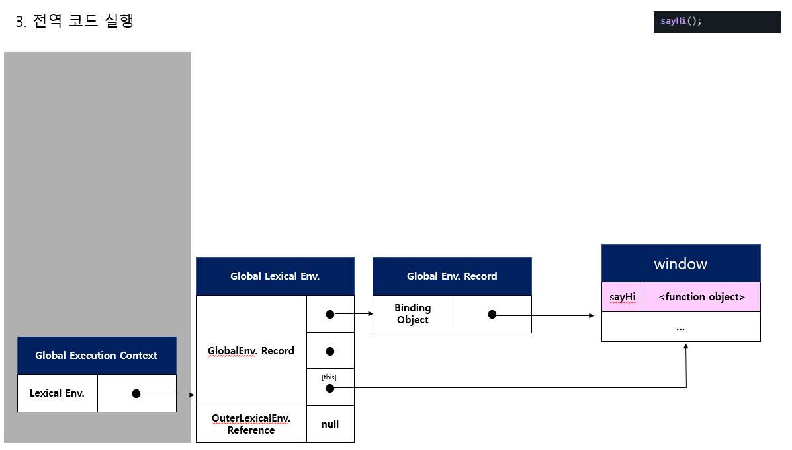

# JS 문제 풀기

> 참고 사이트 : <https://github.com/lydiahallie/javascript-questions>

Thank you! lydiahallie😍

## 1번문제

```javascript
function sayHi() {
  console.log(name);
  console.log(age);
  var name = 'Lydia';
  let age = 21;
}

sayHi();
```

- A: `Lydia` and `undefined`
- B: `Lydia` and `ReferenceError`
- C: `ReferenceError` and `21`
- D: `undefined` and `ReferenceError`

<details>
<summary>My Answer</summary>
<p>정답은 <code>D</code></p>
<ol>
  <li>함수 선언과 호출</li>
  <li>var와 let의 차이</li>
  <li>변수 호이스팅</li>
  <li>코드 평가와 실행</li>
</ol>
  <p>1. 전역에서 sayHi함수가 선언문으로 정의했다. "전역 코드 평가" 시 전역 객체 프로퍼티가 된다. 평가 후 "전역 코드 실행" 때 함수 호출을 실행한다.</p>
  <p>2. 함수 호출 실행 시 "전역 코드 실행"을 멈추고 "함수 코드 평가" 에 들어간다. <code>var name</code>와 <code>let age</code>이 <code>function Env.Record</code>에 등록이 되는데 <code>var</code>는 "선언단계"와 "초기화 단계"가 동시에 이루어져 "undefined"가 할당이 된다. let은 선언단계만 진행이 되므로 "uninitialized"이고, 초기화 단계는 "함수 코드 실행" 시 할당문('=')을 만났을 때 초기화가 이루어진다. </p>
  <p>3."함수 코드 실행" 단계에서 "console" 이라는 함수를 찾기 위해 <code>스코프 체이닝</code> 과정으로 "window" 전역 객체의 프로퍼티에 접근하여 console.log를 실행한다. 참조하는 변수의 name은 위에서처럼 "undefined", age는 "Reference Error" 가 발생한다. 선언 전에 밑에 있는 변수를 위에 끌어다 쓰는 것처럼 보여 이를 <code>변수 호이스팅</code>이라 한다.</p>
  <p> → let으로 선언한 변수의 경우 초기화 전 참조를 하여 이를 <code>TDZ(일시적 사각지대)</code>라고 한다.</p>
  <details>
    <summary>그림</summary>
    </img><br/>
    </img><br/>
    </img><br/>
    </img><br/>
    </img><br/>
  </details>
</details>

## 2번문제

```javascript
for (var i = 0; i < 3; i++) {
  setTimeout(() => console.log(i), 1);
}

for (let i = 0; i < 3; i++) {
  setTimeout(() => console.log(i), 1);
}
```

- A: `0 1 2` and `0 1 2`
- B: `0 1 2` and `3 3 3`
- C: `3 3 3` and `0 1 2`
  <details>
    <summary>My Answer</summary>
    <p>정답은 <code>C</code></p>
    <ol>
      <li>블록레벨 스코프(for)</li>
      <li>var와 let,const의 차이</li>
      <li>렉시컬 환경, 스코프</li>
      <li>콜백함수</li>
      <li>클로저</li>
      <li>이벤트 루프 그리고 콜 스택과 테스트 큐</li>
    </ol>
    <p><code>(Javascript DeepDive p.387 참조)</code><strong>for문의 변수 선언문에 let 키워드를 사용한 for문은 코드블록이 반복해서 실행될때마다 코드블록을 위한 새로운 렉시컬 환경을 생성</strong>한다. 만약 for문의 코드 블록 내에서 정의된 함수가 있다면 이 함수의 상위스코프는 for문의 코드 블록이 생성한 렉시컬 환경이다.</p>
    <p>외부 렉시컬 환경 참조는 <strong>자신이 정의된 환경(상위 스코프)</strong>을 가리킨다.</p>
    <p>[[Enviroment]]도 <strong>자신이 정의된 환경(상위스코프)</strong>을 가리킨다.</p>
    <p><code>(Javascript DeepDive p.386 참조)</code><code>var</code>키워드로 선언한 변수는 오로지 함수의 코드 블록만 지역 스코프로 인정(이걸 함수레벨 블록이라 한다), <code>let</code>, <code>const</code>는 모든 코드 블록을 지역스코프로 인정한다.(블록레벨스코프)</p>
    <p>setTimeout 함수의 렉시컬 환경은 <code>익명함수(anonymous function)</code>의 [[Enviroment]] 내부 슬롯에 의해 참조되고 있어 가비지 컬렉터가 해제하지 않는다. 외부함수(setTimeout)보다 중첩함수(anonymous function)이 더 오래 유지 되었으며, 외부 함수의 변수를 참조할 수 있다. 이러한 중첩 함수를 클로저(closure)라 한다.</p>
    <p>콜백함수는 매개변수로 넘겨지는 함수를 콜백함수라고하고, 매겨변수를 받는 함수를 고차함수라 한다.</p>
    <p>setTimeout, setInterval 같은 함수들은 호출한 후 delay(ms) 후에 Task Queue에 들어가 대기한다. 그리고 실행컨텍스트 스택(콜 스택)이 비워졌을 때 선입선출방식으로 함수가 실행된다.</p>

    <details>
      <summary>그림</summary>
      </img><br/>
      </img><br/>
      </img><br/>
      </img><br/>
    </details>
  </details>

## 3번문제

```javascript
const shape = {
  radius: 10,
  diameter() {
    return this.radius * 2;
  },
  perimeter: () => 2 * Math.PI * this.radius,
};

console.log(shape.diameter());
console.log(shape.perimeter());
```

- A: `20` and `62.83185307179586`
- B: `20` and `NaN`
- C: `20` and `63`
- D: `NaN` and `63`
<details>
<summary>My Answer</summary>
<p>정답은 <code>B</code></p>
<p></p>
<ol>
  <li>일반함수와 화살표함수의 this</li>
</ol>
<p>객체<code>메서드</code>의 <code>this</code>는 객체를 바인딩하고, 객체 프로퍼티에 할당된 <code>arrow function</code>의 <code>this</code>는 해당 코드에서의 상위 컨텍스트인 전역객체를 가리킨다.</p>
<code>
*자세한 내용은 6. this : 핵심 부분에서
</code>
</details>

## 6번문제

```javascript
let c = { greeting: 'Hey!' };
let d;

d = c;
c.greeting = 'Hello';
console.log(d.greeting);
```

- A: `Hello`
- B: `Hey!`
- C: `undefined`
- D: `ReferenceError`
- E: `TypeError`

<details>
<summary>My Answer</summary>
<p>정답은 <code>A</code></p>
<ol>
  <li>참조에 의한 전달</li>
</ol>
<p>c의 참조 값(객체의 메모리 주소 값)을 복사하여 전달하기 때문에, 두개의 식별자(c, d)가 하나의 객체를 공유하여 값이 같다.</p>
<code>
*자세한 내용은 5. 원시타입과 객체(참조)타입에서
</code> 
</details>

## 8번문제

```javascript
class Chameleon {
  static colorChange(newColor) {
    this.newColor = newColor;
    return this.newColor;
  }

  constructor({ newColor = 'green' } = {}) {
    this.newColor = newColor;
  }
}

const freddie = new Chameleon({ newColor: 'purple' });
console.log(freddie.colorChange('orange'));
```

- A: `orange`
- B: `purple`
- C: `green`
- D: `TypeError`

<details>
<summary>My Answer</summary>
<p>정답은 <code>D</code></p>
<ol>
  <li>생성자, 인스턴스</li>
  <li>static(정적) 메서드</li>
</ol>
<p>static(정적) 메서드는 인스턴스를 생성하지 않아도 호출할 수 있는 메서드이다.</p>
<p>정적 메서드는 클래스로 호출한다.(인스턴스로는 호출할 수 없다.)</p>
<code>
*자세한 내용은 7. 클래스에서
</code> 
</details>

## 10번문제

```javascript
function bark() {
  console.log('Woof!');
}

bark.animal = 'dog';
```

- A: Nothing, this is totally fine!
- B: SyntaxError. You cannot add properties to a function this way.
- C: "Woof" gets logged.
- D: ReferenceError

<details>
<summary>My Answer</summary>
<p>정답은 <code>A</code></p>
<ol>
  <li></li>
</ol>
<p>원시 값(숫자, 문자열)을 제외한 Javascript의 거의 모든 것은 객체다. 코드평가 중 정의된 함수가 등록이 되면 함수객체가 만들어진다는 점에서 알 수 있다. 실제로 위 코드처럼 작성하지는 않겠지만, <code>함수객체.animal = 'dog'</code>이 실행되면 함수객체.animal에 dog가 할당된다.</p>
</details>

## 11번문제

```javascript
function Person(firstName, lastName) {
  this.firstName = firstName;
  this.lastName = lastName;
}

const member = new Person('Lydia', 'Hallie');
Person.getFullName = function () {
  return `${this.firstName} ${this.lastName}`;
};

console.log(member.getFullName());
```

- A: `TypeError`
- B: `SyntaxError`
- C: `Lydia Hallie`
- D: `undefined undefined`

<details>
<summary>My Answer</summary>
<p>정답은 <code>A</code></p>
<ol>
  <li></li>
</ol>
<p>생성자(new)를 통해 인스턴스(memeber)를 생성하였다. Person에 getFullName 메서드를 할당하는데, 인스턴스가 getFullName 함수를 호출하고 있다. Person 객체의 메서드이지, 인스턴스의 메서드가 아니다.</p>
<p>인스턴스가 <code>getFullName</code> 메서드를 호출하려면 <code>Person.prototype.getFullName</code>에 함수를 할당해야한다.(답: 'C' 출력)</p>
<p>답 'D' 가 나오는 경우는 <code>member.constructor.getFullName()</code>으로 호출했을 경우이다.</p>
</details>

## 12번문제

```javascript
function Person(firstName, lastName) {
  this.firstName = firstName;
  this.lastName = lastName;
}

const lydia = new Person('Lydia', 'Hallie');
const sarah = Person('Sarah', 'Smith');

console.log(lydia);
console.log(sarah); //undefined

//내가 추가한 코드
console.log(window.firstName); //Sarah
console.log(window.lastName); //Smith
```

- A: Person `{firstName: "Lydia", lastName: "Hallie"}` and `undefined`
- B: Person `{firstName: "Lydia", lastName: "Hallie"}` and Person `{firstName: "Sarah", lastName: "Smith"}`
- C: Person `{firstName: "Lydia", lastName: "Hallie"}` and `{}`
- D: Person `{firstName: "Lydia", lastName: "Hallie"}` and `ReferenceError`

<details>
<summary>My Answer</summary>
<p>정답은 <code>A</code></p>
<ol>
  <li>클래스</li>
  <li>this</li>
</ol>
<p>"lydia"는 new 생성자로 인해 this는 <code>인스턴스 "lydia"</code>를 가리킨다.
<p>"sarah"는 할당이 아니라 함수 호출이다. Person 함수는 return 값이 없으므로, "sarah"는 <code>undefined</code>이다.</p>
<p>Person의 "this"는 전역객체를 참조하므로, <code>window.firstName</code>과 <code>window.lastName</code>은 각각 <code>Sarah</code>, <code>Smith</code>를 출력한다.</p>
<code>
*자세한 내용은 7. 클래스에서
</code> 
</details>

## 13번문제

13. What are the three phases of event propagation?

- A: Target > Capturing > Bubbling
- B: Bubbling > Target > Capturing
- C: Target > Bubbling > Capturing
- D: Capturing > Target > Bubbling

<details>
<summary>My Answer</summary>
<p>정답은 <code>D</code></p>
<p>Capturing phase – 이벤트 요소가 내려가는 단계</p>
<p>Target phase – 이벤트 요소 도달하는 단계</p>
<p>Bubbling phase – 이벤트 요소에서 루트로 올라가는 단계</p>
<code>
https://developer.mozilla.org/ko/docs/Web/API/Event/eventPhase
</code> 
</details>

## 15번문제

```javascript
function sum(a, b) {
  return a + b;
}

sum(1, '2');
```

- A: NaN
- B: TypeError
- C: "12"
- D: 3
<details>
<summary>My Answer</summary>
<p>정답은 <code>C</code></p>
<p>JS는 <code>dynamically typed language</code>이다. C, Java처럼 변수에 타입을 정해져 있지 않고, JS의 타입 유형 검사는 런타임에 수행이 된다. 따라서 변수에 원하는 모든 것을 할당할 수가 있다.</p>
<p>위 문제의 경우에는 타입 강제변환(Type coercion) 또는 암묵적 타입변환(Implicit coercion)이다. Number Type인 1이 String Type 으로 변환하여 문자열이 합쳐져 '12' 결과가 리턴된다.</p>
</details>

## 16번문제

```javascript
let number = 0;
console.log(number++);
console.log(++number);
console.log(number);
```

- A: `1 1 2`
- B: `1 2 2`
- C: `0 2 2`
- D: `0 1 2`
<details>
<summary>My Answer</summary>
<p>정답은 <code>C</code></p>
<p>후위 연산자(number++)는 console.log가 먼저 실행되고 후에 연산한다. 전위 연산자(++number)는 console.log가 실행되기 전 연산한다. 따라서 <code>0 2 2</code>가 출력된다.</p>
</details>

## 17번문제

```javascript
function getPersonInfo(one, two, three) {
  console.log(one);
  console.log(two);
  console.log(three);
}

const person = 'Lydia';
const age = 21;

getPersonInfo`${person} is ${age} years old`;
```

- A: "Lydia" 21 ["", " is ", " years old"]
- B: ["", " is ", " years old"] "Lydia" 21
- C: "Lydia" ["", " is ", " years old"] 21

<details>
<summary>My Answer</summary>
<p>정답은 <code>B</code></p>
<p>이번 키워드는 <code>tagged template literal</code>이다. getPersonInfo의 첫번째 인자에는 정적 데이터가 배열형태로 저장(${}값을 제외한 나머지 문자열)되고, 나머지 인자에는 동적데이터(${})가 저장되어 "정답 B" 형태로 출력된다.</p>

<p>하지만 위 형태는 보다는 rest형식으로 인자를 받는다. rest형식의 tagged template literal은 다음과 같다.</p>
</details>

## 17-1번 문제

```javascript
//Tagged Template Literal (Rest)
function getPersonInfo(one, ...values) {
  console.log(one);
  console.log(values);
}

const person = 'Lydia';
const age = 21;
const country = 'Korea';
const city = 'Suwon';

getPersonInfo`${person} is ${age} years old. I'm live in ${city}, ${country}`;

//["", " is ", " years old. I'm live in ", ", ", ""] (5)
//["Lydia", 21, "Suwon", "Korea"] (4)
```

## 18번 문제

```javascript
function checkAge(data) {
  if (data === { age: 18 }) {
    console.log('You are an adult!');
  } else if (data == { age: 18 }) {
    console.log('You are still an adult.');
  } else {
    console.log(`Hmm.. You don't have an age I guess`);
  }
}

checkAge({ age: 18 });
```

- A: You are an adult!
- B: You are still an adult.
- C: Hmm.. You don't have an age I guess

<details>
<summary>My Answer</summary>
<p>정답은 <code>C</code></p>
<p>매개변수 data는 {age:18} 의 참조 값을 가지고 있다<code>(call-by-reference)</code>. checkAge 함수 내 조건문에서 비교하는 객체는 data 객체와는 별개인 객체이다.<code>객체 리터럴은 평가 될때마다 객체를 생성하기 때문</code> 그렇기 때문에 참조값을 비교하는 과정에서 위 2개의 조건은 false이기 때문에 정답은 C이다.</p>
</details>

## 18-1번 문제

```javascript
let age = {};

function checkAge(data) {
  data.age = 123;
}

checkAge(age);
console.log(age);
```

## 18-2번 문제

```javascript
let age = {};

function checkAge(data) {
  data = 123;
}

checkAge(age);
console.log(age);
```

## 18-3번 문제

```javascript
let age = { age: 18 };

function checkAge(data) {
  let a = age;
  data = { age: 18 };

  //bonus 문제
  console.log(a == age);
  console.log(a === age);
  console.log(age == data);
  console.log(age === data);
}

checkAge(age);
```

<details>
<summary>My Answer</summary>
<p>객체는 변경이 가능한 값, 원시 값은 변경이 불가능하다. 18-1번 에서는 복사한 참조값을 통해 객체에 접근하여 객체의 값을 변경하는 것이기 때문에 age의 출력 값은 <code>{age : 123}</code>이다.</p>
<p>18-2번에서는 data에 123을 할당하려 한다. 이는 자칫 "data 식별자에 123을 할당하니까 아 age값도 123으로 바뀌겠구나"라는 오해를 할 수 있다. 정확히는 data 식별자는 메모리 어딘가 123이 있는 공간을 가리키게 되어, age 값은 변경되지 않아 출력 값은 <code>{}</code>이다.</p>
<p>18-3번에서는 18-2번과 유사하다. 원시 값 대신 객체를 할당한다. "객체니가 혹시..?" 라고 생각할 수 도 있지만, 객체 리터럴은 평가 될때마다 객체를 생성하기 때문에 전혀 다른 객체이다. 18-2번과 같이 {age : 18}이 있는 공간을 가리킬 뿐이다. age 출력 값은 <code>{}</code>이다.</p>

<p>보너스 문제 정답은 true, true, false, false</p>
</details>

## 19번 문제

```javascript
function getAge(...args) {
  console.log(args); // [21]
  console.log(typeof args);
}

getAge(21);
```

- A: "number"
- B: "array"
- C: "object"
- D: "NaN"
<details>
<summary>My Answer</summary>
<p>정답은 <code>C</code></p>
<p>Rest Prameter(나머지 매개변수) : 모든 후속 매개변수를 배열에 저장한다. <code>args</code>는 <code>[21]</code>이다.</p>
<p>Array in MDN Javascript : 다른 프로그래밍 언어의 배열과 마찬가지로 Array 개체를 사용하면 단일 변수 이름으로 여러 항목의 컬렉션을 저장할 수 있으며 일반적인 배열 작업을 수행하기 위한 멤버가 있습니다.</p>
<p>객체는 다양한 키와 복잡한 엔터티를 저장하는데 사용되는 데이터 유형 중 하나이다. Javscript에서의 배열도 
<code>Index를 나타내는 문자열</code>과 <code>길이를 나타내는 length를 프로퍼티</code>로 갖는 특수한 객체이다.</p>
</details>

## 20번 문제

```javascript
function getAge() {
  'use strict';
  age = 21;
  console.log(age);
}

getAge();
```

- A: 21
- B: undefined
- C: ReferenceError
- D: TypeError

<details>
<summary>My Answer</summary>
<p>정답은 <code>C</code></p>
<p></p>
<p><code>strict mode</code>가 아니면 호출 시, "age"는 암묵적 전역변수(window)의 프로퍼티가 되고, <code>console.log(age)</code>에서 참조할 때 스코프 체이닝을 통해 window 객체에 접근하여 <code>21</code>을 출력하게 된다.</p>
<p><code>strict mode</code>에서는 선언하지 않은 변수를 참조하면 Reference Error를 발생시킨다.</p>
</details>

## 21번 문제

```javascript
const sum = eval('10*10+5');
```

- A: `105`
- B: `"105"`
- C: `TypeError`
- D: `"10*10+5"`

<details>
<summary>My Answer</summary>
<p>정답은 <code>A</code></p>
<p></p>
<p><code>eval</code>함수는 문자로 표현된 JS코드를 실행하는 함수이다. 따라서 <code>10*10+5</code>연산이 되어 정답은 105이다. 중간에 <code>문자, 숫자</code>가 섞여 있어도(Ex. '6' * 3) 문자와 숫자가 연산이 된다.</p>
</details>

## 22번 문제

```javascript
sessionStorage.setItem('cool_secret', 123);
```

- A: Forever, the data doesn't get lost.
- B: When the user closes the tab.
- C: When the user closes the entire browser, not only the tab.
- D: When the user shuts off their computer.

<details>
<summary>My Answer</summary>
<p>정답은 <code>B</code></p>
<p>* 설명 출저 : MDN</p>
<p>브라우저가 열려있는 한 새고침과 페이지 복구를 거쳐도 남아있다.</p>
<p>새로운 탭이나 창에서 열면, 세션 쿠키의 동작과는 다르게 최상위 브라우징 맥락의 값을 가진 새로운 새션을 생성한다.</p>
<p>같은 URL을 다수의 탭/창에서 열면 가각의 탭/창에 대해 새로운 <code>sessionStorage</code>를 생성한다.</p>
<p>탭/창을 닫으면 세션이 끝나고 sessionStorage 안의 객체를 초기화한다.</p>
</details>

## 23번 문제

```javascript
var num = 8;
var num = 10;

console.log(num);
```

- A: `8`
- B: `10`
- C: `SyntaxError`
- D: `ReferenceError`
<details>
<summary>My Answer</summary>
<p>정답은 <code>B</code></p>
<p><code>var</code>키워드는 같은 식별자로 선언이 가능하다. 그 식별자의 값은 가장 최근에 할당한 값이 된다.</p>
</details>

## 25번 문제

```javascript
const obj = { a: 'one', b: 'two', a: 'three' };
console.log(obj);
```

- A: `{ a: "one", b: "two" }`
- B: `{ b: "two", a: "three" }`
- C: `{ a: "three", b: "two" }`
- D: `SyntaxError`
<details>
<summary>My Answer</summary>
<p>고른 답 <code>D</code></p>
<p>정답은 <code>C</code></p>
<p>같은 이름의 키가 있을 경우, 위치는 맨 처음 정의한 위치에 지정이 되고, 나중에 정의한 키에 할당한 값으로 대체된다. <STRIKE>(아니 뭐 이런...)</STRIKE></p></hr>
</details>

## 27번 문제

```javascript
for (let i = 1; i < 5; i++) {
  if (i === 3) continue;
  console.log(i);
}
```

- A: `1 2`
- B: `1 2 3`
- C: `1 2 4`
- D: `1 3 4`
<details>
<summary>My Answer</summary>
<p>정답은 <code>C</code></p>
<p>i가 3일 때 continue 문이 실행되면서 반복을 건너뛰어 <code>3</code>을 출력하지 않는다.</p>
</details>

## 29번 문제

```javascript
const a = {};
const b = { key: 'b' };
const c = { key: 'c' };

a[b] = 123;
a[c] = 456;

console.log(a[b]);

// const object1 = {
//   a: 'somestring',
//   b: 42,
//   c: false
// };

// console.log(Object.keys(object1));
// Array ["a", "b", "c"]
// 배열 내 문자임을 확인:
```

- A: `123`
- B: `456`
- C: `undefined`
- D: `ReferenceError`
<details>
<summary>My Answer</summary>
<p>정답은 <code>B</code></p>
<p>객체 키는 자동으로 문자열로 변환된다.</p>
<p>JS에서 객체를 문자열화 시키면 <code>"[object Object]"</code>가 된다. <code>a[b]</code>에서 <code>123</code>을 할당하면 <code>[object Object] = 123</code>가 된다. 그 다음 줄에서도 객체를 문자열화 되어 <code>[object Object] = 456</code>이 되어 답은 <code>B</code></p>
</details>

## 31번 문제

What is the event.target when clicking the button?

```javascript
<div onclick="console.log('first div')">
  <div onclick="console.log('second div')">
    <button onclick="console.log('button')">Click!</button>
  </div>
</div>
```

- A: `Outer div`
- B: `Inner div`
- C: `button`
- D: `An array of all nested elements.`
<details>
<summary>My Answer</summary>
<p>정답은 <code>C</code></p>
<p>Capturing phase – 이벤트 요소가 내려가는 단계</p>
<p>Target phase – 이벤트 요소 도달하는 단계</p>
<p>Bubbling phase – 이벤트 요소에서 루트로 올라가는 단계</p>
</details>

## 33번 문제

What's the output?

```javascript
const person = { name: 'Lydia' };

function sayHi(age) {
  return `${this.name} is ${age}`;
}

console.log(sayHi.call(person, 21));
console.log(sayHi.bind(person, 21));
```

- A: `undefined is 21` `Lydia is 21`
- B: `function` `function`
- C: `Lydia is 21` `Lydia is 21`
- D: `Lydia is 21` `function`
<details>
<summary>My Answer</summary>
<p>정답은 <code>D</code></p>
<p>bind는 apply, call 과 달리 함수를 호출하지 않고, this에 사용할 객체를 전달하기 때문에 function이 출력된다. <code>console.log(sayHi.bind(person, 21)());</code>로 호출해야 답 <code>C</code>가 될 수 있다.</p>
</details>

## 35번 문제

Which of these values are falsy?

```javascript
0;
new Number(0);
('');
(' ');
new Boolean(false);
undefined;
```

- A: 0, '', undefined
- B: 0, new Number(0), '', new Boolean(false), undefined
- C: 0, '', new Boolean(false), undefined
- D: All of them are falsy
<details>
<summary>My Answer</summary>
<p>정답은 <code>A</code></p>
<p>undefined</p>
<p>null</p>
<p>NaN</p>
<p>false</p>
<p>'' (empty string)</p>
<p>0</p>
<p>-0</p>
<p>0n (BigInt(0))</p>
</details>

## 37번 문제

```javascript
const numbers = [1, 2, 3];
numbers[10] = 11;
console.log(numbers);
```

- A: `[1, 2, 3, 7 x null, 11]`
- B: `[1, 2, 3, 11]`
- C: `[1, 2, 3, 7 x empty, 11]`
- D: `SyntaxError`
<details>
<summary>My Answer</summary>
<p>정답은 <code>C</code></p>
<p>배열의 길이를 초과하는 인덱스에 값을 할당하면 JS는 빈 슬롯을 생성한다. 하지만 이는 브라우저, 노드마다 결과 값이 다르다.</p>
<p>Safafi : [1, 2, 3, 10: 11] </p>
<p>Chrome : [1, 2, 3, empty x 7, 11] </p>
</details>

## 41번 문제

```javascript
!!null;
!!'';
!!1;
```

- A: `false` `true` `false`
- B: `false` `false` `true`
- C: `false` `true` `true`
- D: `true` `true` `false`
<details>
<summary>My Answer</summary>
<p>정답은 <code>B</code></p>
<p><code>null</code>, <code>'' (empty string)</code>은 falsy이다. !falsy는 true이며 !true는 false이다.</p>
<p>1은 truthy이며, !1은 false, !!1은 true이다.</p>
</details>

## 43번 문제

```javascript
[...'Lydia'];
```

- A: `["L", "y", "d", "i", "a"]`
- B: `["Lydia"]`
- C: `[[], "Lydia"]`
- D: `[["L", "y", "d", "i", "a"]]`
<details>
<summary>My Answer</summary>
<p>정답은 <code>A</code></p>
<p><code>...(Spread)</code>는 반복 가능한 객체(iterable Object)를 분리시킨다. string은 반복 가능한 객체(iterable Object)이므로 개별 요소로 분리가 가능하다.</p>
</details>

## 45번 문제

```javascript
const firstPromise = new Promise((res, rej) => {
  setTimeout(res, 500, 'one');
});

const secondPromise = new Promise((res, rej) => {
  setTimeout(res, 100, 'two');
});

Promise.race([firstPromise, secondPromise]).then((res) => console.log(res));
```

- A: `"one"`
- B: `"two"`
- C: `"two"` `"one"`
- D: `"one"` `"two"`
<details>
<summary>My Answer</summary>
<p>정답은 <code>B</code></p>
<p>race는 iterable 안에 있는 프로미스 중에 가장 먼저 완료된 것의 결과값으로 그대로 이행, 거부한다. secondPromise가 먼저 완료되기 때문에 Promise.race는 <code>"two"</code>를 리턴한다.</p>
</details>

## 47번 문제

```javascript
const person = {
  name: 'Lydia',
  age: 21,
};

for (const item in person) {
  console.log(item);
}
```

- A: `{ name: "Lydia" }, { age: 21 }`
- B: `"name", "age"`
- C: `"Lydia", 21`
- D: `["name", "Lydia"], ["age", 21]`
<details>
<summary>My Answer</summary>
<p>정답은 <code>B</code></p>
<p><code>for...in</code>은 객체의 속성(key) 수 만큼 반복 작업을 수행한다. person 객체의 키값이 item에 할당되어 item이 출력되므로 정답은 B </p>
</details>

## 49번 문제

```javascript
const num = parseInt('7*6', 10);
```

- A: `42`
- B: `"42"`
- C: `7`
- D: `NaN`
<details>
<summary>My Answer</summary>
<p>정답은 <code>C</code></p>
<p><code>parseInt(string, radix)</code>는 문자열 인자를 파싱하여 두번째 인자인 특정 진수의 정수를 반환한다.</p>
<p>첫번째 인자에서 문자열에서 숫자가 아닌 문자일 때 다음 문자를 무시하기 때문에 정답은 <code>7</code></p>
</details>

## 51번 문제

```javascript
function getInfo(member, year) {
  member.name = 'Lydia';
  year = '1998';
}

const person = { name: 'Sarah' };
const birthYear = '1997';

getInfo(person, birthYear);

console.log(person, birthYear);
```

- A: `{ name: "Lydia" }, "1997"`
- B: `{ name: "Sarah" }, "1998"`
- C: `{ name: "Lydia" }, "1998"`
- D: `{ name: "Sarah" }, "1997"`
<details>
<summary>My Answer</summary>
<p>정답은 <code>A</code></p>
<p>값으로 전달되며 값이 개체가 아니면 참조로 전달된다. birthYear는 객체가 아니라 문자열이기 때문에 값으로 전달됩니다. 값으로 인수를 전달할 때 해당 값의 복사본이 생성된다.</p>
<p>getInfo 함수 호출 시 person객체의 값이 변경되지만, birthYear 같은 경우는 참조하는 값과 동일하지 않기때문에 정답은 A</p>
</details>

## 53번 문제

```javascript
function Car() {
  this.make = 'Lamborghini';
  return { make: 'Maserati' };
}

const myCar = new Car();
console.log(myCar.make);
```

- A: `"Lamborghini"`
- B: `"Maserati"`
- C: `ReferenceError`
- D: `TypeError`
<details>
<summary>My Answer</summary>
<p>정답은 <code>B</code></p>
<p>생성된 객체의 프로퍼티는 Car()함수가 리턴한 객체의 프로퍼티가 된다.</p>
<p>return 문이 없다면 <code>myCar.make</code>는 'Lamborghini'이다.</p>
<p>return 문에 의해<code>myCar.make</code>는 'Maserati'이다.</p>
</details>

## 53-1번 문제

```javascript
function Car() {
  this.make = 'Lamborghini';
  return { hi: 'Hello' };
}

const myCar = new Car();
console.log(myCar.make); //undefined
console.log(myCar.hi); //Hello
```

## 55번 문제

```javascript
class Dog {
  constructor(name) {
    this.name = name;
  }
}

Dog.prototype.bark = function () {
  console.log(`Woof I am ${this.name}`);
};

const pet = new Dog('Mara');

pet.bark();

delete Dog.prototype.bark;

pet.bark();
```

- A: `"Woof I am Mara"`, `TypeError`
- B: `"Woof I am Mara"`, `"Woof I am Mara"`
- C: `"Woof I am Mara"`, `undefined`
- D: `TypeError`, `TypeError`
<details>
<summary>My Answer</summary>
<p>정답은 <code>A</code></p>
<p><code>delete</code>연산는 객체의 속성을 제거한다. 제거한 객체의 참조를 어디에서도 사용하지 않는다면 나중에 자원을 회수한다.(MDN Javscript)</p>
<p>객체 속성을 제거하였으나, 참조 시 접근 시도를 하기 때문에 함수가 아닌 것을 호출하려고 하면 TypeErrorr가 발생하게 된다.</p>
</details>

## 57번 문제

```javascript
// counter.js
let counter = 10;
export default counter;

// index.js
import myCounter from './counter';

myCounter += 1;

console.log(myCounter);
```

- A: `10`
- B: `11`
- C: `Error`
- D: `NaN`
<details>
<summary>My Answer</summary>
<p>정답은 <code>C</code></p>
<p>가져온 모듈은 읽기 전용이므로 가져온 모듈을 수정할 수 없다. 그것들을 내보내는 모듈안에서만 값 변경이 가능하다.

따라서, myCounter 값을 증가시키려고 하면 오류가 발생합니다. myCounter는 읽기 전용이며 수정이 불가능하다.</p>

</details>

## 61번 문제

```javascript
const person = { name: 'Lydia' };

Object.defineProperty(person, 'age', { value: 21 });

console.log(person);
console.log(Object.keys(person));
```

- A: `{ name: "Lydia", age: 21 }`, `["name", "age"]`
- B: `{ name: "Lydia", age: 21 }`, `["name"]`
- C: `{ name: "Lydia"}`, `["name", "age"]`
- D: `{ name: "Lydia"}`, `["age"]`
<details>
<summary>My Answer</summary>
<p>정답은 <code>B</code></p>
<p>MDN(Javascript): By default, values added using Object.defineProperty() are immutable and not enumerable.</p>

<p>기본적으로 Object.defineProperty()를 사용하여 추가된 값은 변경할 수 없으며 열거할 수 없습니다.</p>
<p>defineProperty(obj, prop, descriptor)를 통해 person 프로퍼티에 age를 추가하였으나, 열거할 수 없기 때문에 age는 출력되지 않는다.</p>
</details>

## 63번 문제

```javascript
let num = 10;

const increaseNumber = () => num++;
const increasePassedNumber = (number) => number++;

const num1 = increaseNumber();
const num2 = increasePassedNumber(num1);

console.log(num1);
console.log(num2);
```

- A: `10`, `10`
- B: `10`, `11`
- C: `11`, `11`
- D: `11`, `12`
<details>
<summary>My Answer</summary>
<p>정답은 <code>A</code></p>
<p>++연산자는 피연산자 값을 반환한 다음 연산한다. increaseNumber()이 num이 증가하기 전 num1에 10을 반환하고, num을 1 증가시킨다.</p>
<p>그리고 num1(10)을 increasePassedNumber()함수 파라미터에 할당하는데 이 함수 또한 반환 후 연산하여, num2도 10이다. 따라서 답은 <code>A</code></p>
</details>

## 65번 문제

```javascript
[1, 2, 3, 4].reduce((x, y) => console.log(x, y));
```

- A: `1 2` and `3 3` and `6 4`
- B: `1 2` and `2 3` and `3 4`
- C: `1 undefined` and `2 undefined` and `3 undefined` and `4 undefined`
- D: `1 2` and `undefined 3` and `undefined 4`
<details>
<summary>My Answer</summary>
<p>정답은 <code>D</code></p>
<p>reduce 함수는 최초 초기화값이 없으면 가장 맨 앞의 값이 accumulator이다. 그리고 두번째 값이 현재 값이 되는데 콜백함수에서 리턴이 아닌 단순히 파라미터를 출력한다.</p>
<p>reduce 함수에서 값을 반환하지 않으면 <code>undefined</code>반환한다. 그래서 다음 반복에서는 undefined 3이 출력되고 그 다음 반복에서도 undefined 4 가 출력되어 정답은 <code>D</code></p>
</details>

## 67번 문제

```javascript
// index.js
console.log('running index.js');
import { sum } from './sum.js';
console.log(sum(1, 2));

// sum.js
console.log('running sum.js');
export const sum = (a, b) => a + b;
```

- A: `running index.js`, `running sum.js`, `3`
- B: `running sum.js`, `running index.js`, `3`
- C: `running sum.js`, `3`, `running index.js`
- D: `running index.js`, `undefined`, `running sum.js`
<details>
<summary>My Answer</summary>
<p>정답은 <code>B</code></p>
<p>import 키워드를 사용하면 가져온 모든 모듈이 미리 구문이 분석이 되어 가져온 모듈이 먼저 실행되고 모듈을 가져오는 파일의 코드가 나중에 실행된다.</p>
<p>즉, sum.js의 console.log가 먼저 실행되고, index.js console.log가 출력된다. 그리고 마지막으로 sum함수가 실행된 결과 값이 출력되어 정답은 <code>B</code></p>
</details>

## 69번 문제

```javascript
const name = 'Lydia Hallie';
console.log(name.padStart(13));
console.log(name.padStart(2));
```

- A: `"Lydia Hallie"`, `"Lydia Hallie"`
- B: `" Lydia Hallie"`, `" Lydia Hallie"` (`"[13x whitespace]Lydia Hallie"`, `"[2x whitespace]Lydia Hallie"`)
- C: `" Lydia Hallie"`, `"Lydia Hallie"` (`"[1x whitespace]Lydia Hallie", "Lydia Hallie"`)
- D: `"Lydia Hallie"`, `"Lyd"`
<details>
<summary>My Answer</summary>
<p>정답은 <code>C</code></p>
<p>padStart는 현재 문자열의 시작을 다른 문자열로 채워, 주어진 길이를 만족하는 새로운 문자열을 반환한다.</p>
<p>Lydia Hallie는 총 12자릿수 이며, padStart(13)이므로 맨 앞자리 한칸을 띄운 문자열을 반환한다.</p>
<p>padStart(2)는 문자열 자릿수보다 적으므로, 문자열을 그대로 반환한다.</p>
</details>

## 71번 문제

```javascript
function* startGame() {
  const answer = yield 'Do you love JavaScript?';
  if (answer !== 'Yes') {
    return "Oh wow... Guess we're gone here";
  }
  return 'JavaScript loves you back ❤️';
}

const game = startGame();
console.log(/* 1 */); // Do you love JavaScript?
console.log(/* 2 */); // JavaScript loves you back ❤️
```

- A: `game.next("Yes").value` and `game.next().value`
- B: `game.next.value("Yes")` and `game.next.value()`
- C: `game.next().value`and `game.next("Yes").value`
- D: `game.next.value()` and `game.next.value("Yes")`
<details>
<summary>My Answer</summary>
<p>정답은 <code>C</code></p>
<p>생성기 함수는 yield 키워드를 보면 실행을 멈춘다. 먼저, 함수가 "Do you love JavaScript?" 이기 때문에 이는 game.next().value를 호출해야한다.</p>
<p>game.next("Yes").value를 호출하면 이전 수율이 next() 함수에 전달된 매개변수 값으로 대체된다. Yes가 되어 두번째 출력에서 Javascript loves you back을 출력한다.</p>
</details>

## 73번 문제

```javascript
async function getData() {
  return await Promise.resolve('I made it!');
}

const data = getData();
console.log(data);
```

- A: `"I made it!"`
- B: `Promise {<resolved>: "I made it!"}`
- C: `Promise {<pending>}`
- D: `undefined`
<details>
<summary>My Answer</summary>
<p>정답은 <code>C</code></p>
<p>async함수는 항상 Promise 객체를 반환하기 때문에 정답은 C</p>
</details>

## 75번 문제

```javascript
const box = { x: 10, y: 20 };

Object.freeze(box);

const shape = box;
shape.x = 100;

console.log(shape);
```

- A: `{ x: 100, y: 20 }`
- B: `{ x: 10, y: 20 }`
- C: `{ x: 100 }`
- D: `ReferenceError`
<details>
<summary>My Answer</summary>
<p>정답은 <code>B</code></p>
<p>Object.freeze는 객체의 속성을 변경이 불가하다. 위 예제에서는 shape 식별자는 box가 가리키는 메모리의 값을 가지게 되고, freeze에 의해 변경이 불가하기 때문에 정답은 B</p>
</details>

## 77번 문제 : Is this pure function?

```javascript
function sum(a, b) {
  return a + b;
}
```

- A: Yes
- B: No

<details>
<summary>My Answer</summary>
<p>정답은 <code>B</code></p>
<p>pure function이란 인수가 전달되는 경우 항상 동일한 결과를 반환하는 함수이다. (pure function = Consistent Results)</p>
<p>또한 side Effect가 없다면 pure function으로 봐도 된다.(전역 변수가 function에 쓰일경우)</p>
<p>두개의 인수를 전달할 경우 두 개의 인수만이 연산하여 리턴하기 때문에 정답은 A</p>
<p></p>
</details>
