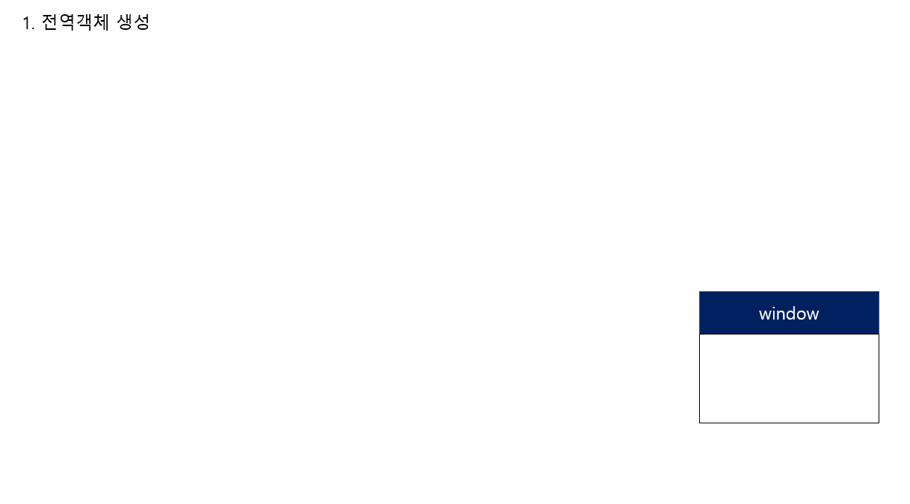

# JS 문제 풀기
> 참고 사이트 : <https://github.com/lydiahallie/javascript-questions>

Thank you! lydiahallie😍

## 1번문제
```javascript
function sayHi() {
  console.log(name);
  console.log(age);
  var name = 'Lydia';
  let age = 21;
}

sayHi();
```
* A: `Lydia` and `undefined`
* B: `Lydia` and `ReferenceError`
* C: `ReferenceError` and `21`
* D: `undefined` and `ReferenceError`

<details>
<summary>My Answer</summary>
<p>정답은 <code>D</code></p>
<ol>
  <li>함수 선언과 호출</li>
  <li>var와 let의 차이</li>
  <li>변수 호이스팅</li>
  <li>코드 평가와 실행</li>
</ol>
  <p>1. 전역에서 sayHi함수가 선언문으로 정의했다. "전역 코드 평가" 시 전역 객체 프로퍼티가 된다. 평가 후 "전역 코드 실행" 때 함수 호출을 실행한다.</p>
  <p>2. 함수 호출 실행 시 "전역 코드 실행"을 멈추고 "함수 코드 평가" 에 들어간다. <code>var name</code>와 <code>let age</code>이 <code>function Env.Record</code>에 등록이 되는데 <code>var</code>는 "선언단계"와 "초기화 단계"가 동시에 이루어져 "undefined"가 할당이 된다. let은 선언단계만 진행이 되므로 "uninitialized"이고, 초기화 단계는 "함수 코드 실행" 시 할당문('=')을 만났을 때 초기화가 이루어진다. </p>
  <p>3."함수 코드 실행" 단계에서 "console" 이라는 함수를 찾기 위해 <code>스코프 체이닝</code> 과정으로 "window" 전역 객체의 프로퍼티에 접근하여 console.log를 실행한다. 참조하는 변수의 name은 위에서처럼 "undefined", age는 "Reference Error" 가 발생한다. 선언 전에 밑에 있는 변수를 위에 끌어다 쓰는 것처럼 보여 이를 <code>변수 호이스팅</code>이라 한다.</p>
  <p> → let으로 선언한 변수의 경우 초기화 전 참조를 하여 이를 <code>TDZ(일시적 사각지대)</code>라고 한다.</p>
  <details>
    <summary>그림</summary>
    </img><br/>
    </img><br/>
    </img><br/>
    </img><br/>
    </img><br/>
  </details>
</details>

## 2번문제
```javascript
for (var i = 0; i < 3; i++) {
  setTimeout(() => console.log(i), 1);
}

for (let i = 0; i < 3; i++) {
  setTimeout(() => console.log(i), 1);
}
```
* A: `0 1 2` and `0 1 2`
* B: `0 1 2` and `3 3 3`
* C: `3 3 3` and `0 1 2`
<details>
  <summary>My Answer</summary>
  <p>정답은 <code>C</code></p>
  <ol>
    <li>블록레벨 스코프(for)</li>
    <li>var와 let,const의 차이</li>
    <li>렉시컬 환경, 스코프</li>
    <li>콜백함수</li>
    <li>클로저</li>
    <li>이벤트 루프 그리고 콜 스택과 테스트 큐</li>
  </ol>
  <p><code>(Javascript DeepDive p.387 참조)</code><strong>for문의 변수 선언문에 let 키워드를 사용한 for문은 코드블록이 반복해서 실행될때마다 코드블록을 위한 새로운 렉시컬 환경을 생성</strong>한다. 만약 for문의 코드 블록 내에서 정의된 함수가 있다면 이 함수의 상위스코프는 for문의 코드 블록이 생성한 렉시컬 환경이다.</p>
  <p>외부 렉시컬 환경 참조는 <strong>자신이 정의된 환경(상위 스코프)</strong>을 가리킨다.</p>
  <p>[[Enviroment]]도 <strong>자신이 정의된 환경(상위스코프)</strong>을 가리킨다.</p>
  <p><code>(Javascript DeepDive p.386 참조)</code><code>var</code>키워드로 선언한 변수는 오로지 함수의 코드 블록만 지역 스코프로 인정(이걸 함수레벨 블록이라 한다), <code>let</code>, <code>const</code>는 모든 코드 블록을 지역스코프로 인정한다.(블록레벨스코프)</p>
  <p>setTimeout 함수의 렉시컬 환경은 <code>익명함수(anonymous function)</code>의 [[Enviroment]] 내부 슬롯에 의해 참조되고 있어 가비지 컬렉터가 해제하지 않는다. 외부함수(setTimeout)보다 중첩함수(anonymous function)이 더 오래 유지 되었으며, 외부 함수의 변수를 참조할 수 있다. 이러한 중첩 함수를 클로저(closure)라 한다.</p>
  <p>콜백함수는 매개변수로 넘겨지는 함수를 콜백함수라고하고, 매겨변수를 받는 함수를 고차함수라 한다.</p>
  <p>setTimeout, setInterval 같은 함수들은 호출한 후 delay(ms) 후에 Task Queue에 들어가 대기한다. 그리고 실행컨텍스트 스택(콜 스택)이 비워졌을 때 선입선출방식으로 함수가 실행된다.</p>

  <details>
    <summary>그림</summary>
    </img><br/>
    </img><br/>
    </img><br/>
    </img><br/>
  </details>
</details>

## 3번문제
```javascript
const shape = {
  radius: 10,
  diameter() {
    return this.radius * 2;
  },
  perimeter: () => 2 * Math.PI * this.radius
};

console.log(shape.diameter());
console.log(shape.perimeter());
```
* A: `20` and `62.83185307179586`
* B: `20` and `NaN`
* C: `20` and `63`
* D: `NaN` and `63`
<details>
<summary>My Answer</summary>
<p>정답은 <code>B</code></p>
<p></p>
<ol>
  <li>일반함수와 화살표함수의 this</li>
</ol>
<p>객체<code>메서드</code>의 <code>this</code>는 객체를 바인딩하고, 객체 프로퍼티에 할당된 <code>arrow function</code>의 <code>this</code>는 해당 코드에서의 상위 컨텍스트인 전역객체를 가리킨다.</p>
<code>
*자세한 내용은 6. this : 핵심 부분에서
</code>
</details>

## 6번문제
```javascript
let c = { greeting: 'Hey!' };
let d;

d = c;
c.greeting = 'Hello';
console.log(d.greeting);
```
* A: `Hello`
* B: `Hey!`
* C: `undefined`
* D: `ReferenceError`
* E: `TypeError`

<details>
<summary>My Answer</summary>
<p>정답은 <code>A</code></p>
<ol>
  <li>참조에 의한 전달</li>
</ol>
<p>c의 참조 값(객체의 메모리 주소 값)을 복사하여 전달하기 때문에, 두개의 식별자(c, d)가 하나의 객체를 공유하여 값이 같다.</p>
<code>
*자세한 내용은 5. 원시타입과 객체(참조)타입에서
</code> 
</details>

## 8번문제
```javascript
class Chameleon {
  static colorChange(newColor) {
    this.newColor = newColor;
    return this.newColor;
  }

  constructor({ newColor = 'green' } = {}) {
    this.newColor = newColor;
  }
}

const freddie = new Chameleon({ newColor: 'purple' });
console.log(freddie.colorChange('orange'));
```
* A: `orange`
* B: `purple`
* C: `green`
* D: `TypeError`

<details>
<summary>My Answer</summary>
<p>정답은 <code>D</code></p>
<ol>
  <li>생성자, 인스턴스</li>
  <li>static(정적) 메서드</li>
</ol>
<p>static(정적) 메서드는 인스턴스를 생성하지 않아도 호출할 수 있는 메서드이다.</p>
<p>정적 메서드는 클래스로 호출한다.(인스턴스로는 호출할 수 없다.)</p>
<code>
*자세한 내용은 7. 클래스에서
</code> 
</details>

## 10번문제
```javascript
function bark() {
  console.log('Woof!');
}

bark.animal = 'dog';

```
* A: Nothing, this is totally fine!
* B: SyntaxError. You cannot add properties to a function this way.
* C: "Woof" gets logged.
* D: ReferenceError

<details>
<summary>My Answer</summary>
<p>정답은 <code>A</code></p>
<ol>
  <li></li>
</ol>
<p>원시 값(숫자, 문자열)을 제외한 Javascript의 거의 모든 것은 객체다. 코드평가 중 정의된 함수가 등록이 되면 함수객체가 만들어진다는 점에서 알 수 있다. 실제로 위 코드처럼 작성하지는 않겠지만, <code>함수객체.animal = 'dog'</code>이 실행되면 함수객체.animal에 dog가 할당된다.</p>
</details>

## 11번문제
```javascript
function Person(firstName, lastName) {
  this.firstName = firstName;
  this.lastName = lastName;
}

const member = new Person('Lydia', 'Hallie');
Person.getFullName = function() {
  return `${this.firstName} ${this.lastName}`;
};

console.log(member.getFullName());
```
* A: `TypeError`
* B: `SyntaxError`
* C: `Lydia Hallie`
* D: `undefined undefined`

<details>
<summary>My Answer</summary>
<p>정답은 <code>A</code></p>
<ol>
  <li></li>
</ol>
<p>생성자(new)를 통해 인스턴스(memeber)를 생성하였다. Person에 getFullName 메서드를 할당하는데, 인스턴스가 getFullName 함수를 호출하고 있다. Person 객체의 메서드이지, 인스턴스의 메서드가 아니다.</p>
<p>인스턴스가 <code>getFullName</code> 메서드를 호출하려면 <code>Person.prototype.getFullName</code>에 함수를 할당해야한다.(답: 'C' 출력)</p>
<p>답 'D' 가 나오는 경우는 <code>member.constructor.getFullName()</code>으로 호출했을 경우이다.</p>
</details>

## 12번문제
```javascript
function Person(firstName, lastName) {
  this.firstName = firstName;
  this.lastName = lastName;
}

const lydia = new Person('Lydia', 'Hallie');
const sarah = Person('Sarah', 'Smith');

console.log(lydia);
console.log(sarah); //undefined

//내가 추가한 코드
console.log(window.firstName); //Sarah
console.log(window.lastName); //Smith

```
* A: Person `{firstName: "Lydia", lastName: "Hallie"}` and `undefined`
* B: Person `{firstName: "Lydia", lastName: "Hallie"}` and Person `{firstName: "Sarah", lastName: "Smith"}`
* C: Person `{firstName: "Lydia", lastName: "Hallie"}` and `{}`
* D: Person `{firstName: "Lydia", lastName: "Hallie"}` and `ReferenceError`

<details>
<summary>My Answer</summary>
<p>정답은 <code>A</code></p>
<ol>
  <li>클래스</li>
  <li>this</li>
</ol>
<p>"lydia"는 new 생성자로 인해 this는 <code>인스턴스 "lydia"</code>를 가리킨다.
<p>"sarah"는 할당이 아니라 함수 호출이다. Person 함수는 return 값이 없으므로, "sarah"는 <code>undefined</code>이다.</p>
<p>Person의 "this"는 전역객체를 참조하므로, <code>window.firstName</code>과 <code>window.lastName</code>은 각각 <code>Sarah</code>, <code>Smith</code>를 출력한다.</p>
<code>
*자세한 내용은 7. 클래스에서
</code> 
</details>

## 13번문제
13. What are the three phases of event propagation?

* A: Target > Capturing > Bubbling
* B: Bubbling > Target > Capturing
* C: Target > Bubbling > Capturing
* D: Capturing > Target > Bubbling

<details>
<summary>My Answer</summary>
<p>정답은 <code>D</code></p>
<p>Capturing phase – 이벤트 요소가 내려가는 단계</p>
<p>Target phase – 이벤트 요소 도달하는 단계</p>
<p>Bubbling phase – 이벤트 요소에서 루트로 올라가는 단계</p>
<code>
https://developer.mozilla.org/ko/docs/Web/API/Event/eventPhase
</code> 
</details>

## 15번문제
```javascript
function sum(a, b) {
  return a + b;
}

sum(1, '2');
```
* A: NaN
* B: TypeError
* C: "12"
* D: 3
<details>
<summary>My Answer</summary>
<p>정답은 <code>C</code></p>
<p>JS는 <code>dynamically typed language</code>이다. C, Java처럼 변수에 타입을 정해져 있지 않고, JS의 타입 유형 검사는 런타임에 수행이 된다. 따라서 변수에 원하는 모든 것을 할당할 수가 있다.</p>
<p>위 문제의 경우에는 타입 강제변환(Type coercion) 또는 암묵적 타입변환(Implicit coercion)이다. Number Type인 1이 String Type 으로 변환하여 문자열이 합쳐져 '12' 결과가 리턴된다.</p>
</details>

## 16번문제
```javascript
let number = 0;
console.log(number++);
console.log(++number);
console.log(number);
```
* A: `1 1 2`
* B: `1 2 2`
* C: `0 2 2`
* D: `0 1 2`
<details>
<summary>My Answer</summary>
<p>정답은 <code>C</code></p>
<p>후위 연산자(number++)는 console.log가 먼저 실행되고 후에 연산한다. 전위 연산자(++number)는 console.log가 실행되기 전 연산한다. 따라서 <code>0 2 2</code>가 출력된다.</p>
</details>

## 17번문제
```javascript
function getPersonInfo(one, two, three) {
  console.log(one);
  console.log(two);
  console.log(three);
}

const person = 'Lydia';
const age = 21;

getPersonInfo`${person} is ${age} years old`;

```
* A: "Lydia" 21 ["", " is ", " years old"]
* B: ["", " is ", " years old"] "Lydia" 21
* C: "Lydia" ["", " is ", " years old"] 21

<details>
<summary>My Answer</summary>
<p>정답은 <code>B</code></p>
<p>이번 키워드는 <code>tagged template literal</code>이다. getPersonInfo의 첫번째 인자에는 정적 데이터가 배열형태로 저장(${}값을 제외한 나머지 문자열)되고, 나머지 인자에는 동적데이터(${})가 저장되어 "정답 B" 형태로 출력된다.</p>

<p>하지만 위 형태는 보다는 rest형식으로 인자를 받는다. rest형식의 tagged template literal은 다음과 같다.</p>
</details>

## 17-1번 문제
```javascript
//Tagged Template Literal (Rest)
function getPersonInfo(one, ...values) {
  console.log(one);
  console.log(values);
}

const person = 'Lydia';
const age = 21;
const country = "Korea";
const city = "Suwon"

getPersonInfo`${person} is ${age} years old. I'm live in ${city}, ${country}`;


//["", " is ", " years old. I'm live in ", ", ", ""] (5)
//["Lydia", 21, "Suwon", "Korea"] (4)
```

## 18번 문제
```javascript
function checkAge(data) {
  if (data === { age: 18 }) {
    console.log('You are an adult!');
  } else if (data == { age: 18 }) {
    console.log('You are still an adult.');
  } else {
    console.log(`Hmm.. You don't have an age I guess`);
  }
}

checkAge({ age: 18 });
```
* A: You are an adult!
* B: You are still an adult.
* C: Hmm.. You don't have an age I guess

<details>
<summary>My Answer</summary>
<p>정답은 <code>C</code></p>
<p>매개변수 data는 {age:18} 의 참조 값을 가지고 있다<code>(call-by-reference)</code>. checkAge 함수 내 조건문에서 비교하는 객체는 data 객체와는 별개인 객체이다.<code>객체 리터럴은 평가 될때마다 객체를 생성하기 때문</code> 그렇기 때문에 참조값을 비교하는 과정에서 위 2개의 조건은 false이기 때문에 정답은 C이다.</p>
</details>

## 18-1번 문제
```javascript
let age = {};

function checkAge(data) {
  data.age = 123;
}

checkAge(age);
console.log(age);
```

## 18-2번 문제
```javascript
let age = {};

function checkAge(data) {
  data = 123;
}

checkAge(age);
console.log(age);
```

## 18-3번 문제
```javascript
let age = {age : 18};

function checkAge(data) {
  let a = age;
  data = {age : 18};

  //bonus 문제
  console.log(a == age);
  console.log(a === age);
  console.log(age == data);
  console.log(age === data);

}

checkAge(age);
```
<details>
<summary>My Answer</summary>
<p>객체는 변경이 가능한 값, 원시 값은 변경이 불가능하다. 18-1번 에서는 복사한 참조값을 통해 객체에 접근하여 객체의 값을 변경하는 것이기 때문에 age의 출력 값은 <code>{age : 123}</code>이다.</p>
<p>18-2번에서는 data에 123을 할당하려 한다. 이는 자칫 "data 식별자에 123을 할당하니까 아 age값도 123으로 바뀌겠구나"라는 오해를 할 수 있다. 정확히는 data 식별자는 메모리 어딘가 123이 있는 공간을 가리키게 되어, age 값은 변경되지 않아 출력 값은 <code>{}</code>이다.</p>
<p>18-3번에서는 18-2번과 유사하다. 원시 값 대신 객체를 할당한다. "객체니가 혹시..?" 라고 생각할 수 도 있지만, 객체 리터럴은 평가 될때마다 객체를 생성하기 때문에 전혀 다른 객체이다. 18-2번과 같이 {age : 18}이 있는 공간을 가리킬 뿐이다. age 출력 값은 <code>{}</code>이다.</p>

<p>보너스 문제 정답은 true, true, false, false</p>
</details>

## 19번 문제
```javascript
function getAge(...args) {
  console.log(args) // [21]
  console.log(typeof args);
}

getAge(21);
```
* A: "number"
* B: "array"
* C: "object"
* D: "NaN"
<details>
<summary>My Answer</summary>
<p>정답은 <code>C</code></p>
<p>Rest Prameter(나머지 매개변수) : 모든 후속 매개변수를 배열에 저장한다. <code>args</code>는 <code>[21]</code>이다.</p>
<p>Array in MDN Javascript : 다른 프로그래밍 언어의 배열과 마찬가지로 Array 개체를 사용하면 단일 변수 이름으로 여러 항목의 컬렉션을 저장할 수 있으며 일반적인 배열 작업을 수행하기 위한 멤버가 있습니다.</p>
<p>객체는 다양한 키와 복잡한 엔터티를 저장하는데 사용되는 데이터 유형 중 하나이다. Javscript에서의 배열도 
<code>Index를 나타내는 문자열</code>과 <code>길이를 나타내는 length를 프로퍼티</code>로 갖는 특수한 객체이다.</p>
</details>

## 20번 문제
```javascript
function getAge() {
  'use strict';
  age = 21;
  console.log(age);
}

getAge();
```
* A: 21
* B: undefined
* C: ReferenceError
* D: TypeError

<details>
<summary>My Answer</summary>
<p>정답은 <code>C</code></p>
<p></p>
<p><code>strict mode</code>가 아니면 호출 시, "age"는 암묵적 전역변수(window)의 프로퍼티가 되고, <code>console.log(age)</code>에서 참조할 때 스코프 체이닝을 통해 window 객체에 접근하여 <code>21</code>을 출력하게 된다.</p>
<p><code>strict mode</code>에서는 선언하지 않은 변수를 참조하면 Reference Error를 발생시킨다.</p>
</details>

## 21번 문제
```javascript
const sum = eval('10*10+5');
```
* A: `105`
* B: `"105"`
* C: `TypeError`
* D: `"10*10+5"`

<details>
<summary>My Answer</summary>
<p>정답은 <code>A</code></p>
<p></p>
<p><code>eval</code>함수는 문자로 표현된 JS코드를 실행하는 함수이다. 따라서 <code>10*10+5</code>연산이 되어 정답은 105이다. 중간에 <code>문자, 숫자</code>가 섞여 있어도(Ex. '6' * 3) 문자와 숫자가 연산이 된다.</p>
</details>